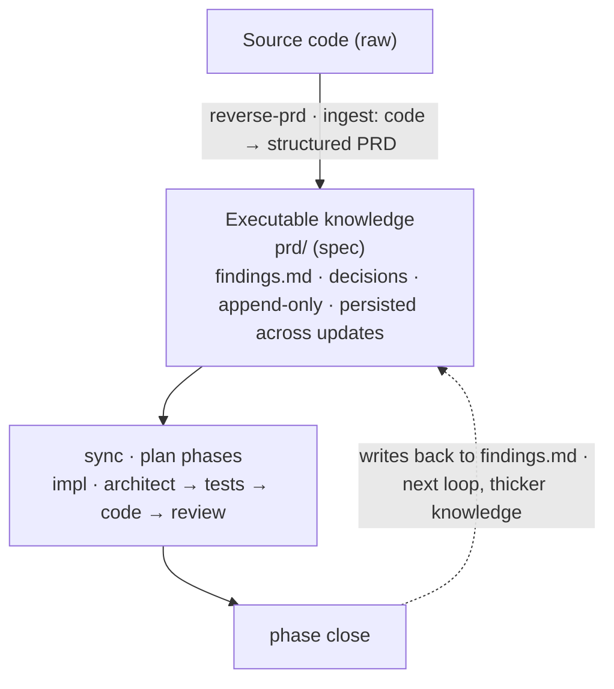

# super-manus

> 🌐 **Languages**: **English** · [简体中文](README.zh-CN.md)

> **v0.9.8 release notes — engineering wiki layer** (additive on top of v0.9.7; one helper rename; one drift-gate pass added, non-blocking):
>
> The driver for this release is **giving cross-module engineering wisdom a real home**. v0.9.4 R6 already had cross-update reflection memory via `sm_collect_reflections`, but it was scoped to one module — a lesson learned in module A (e.g. "Python 3.12 deprecated `datetime.utcnow`") couldn't reach module B's architect on its next phase. Dogfooding showed orchestrators manually re-injecting reflections from sibling modules as a workaround. v0.9.8 makes the channel first-class: project-global `wiki/` layer, reviewer-flagged ingest, four-spawn injection, on-demand lint.
>
> - **NEW** `docs/super-manus/wiki/` directory (project-global, sibling to `prd/`). LLM-maintained `_index.md` catalog + append-only `_log.md` event ledger + on-demand `<topic>.md` topic files (created at first promote, NOT seeded — projects accumulate their own). Seeded by `/super-manus:start` (idempotent — re-running on an existing project picks up the skeleton).
> - **NEW** reviewer `wiki-candidates:` verdict field (pre-close only) + orchestrator promote gate (`AskUserQuestion` per candidate; accept appends to `wiki/<topic>.md` + regenerates `_index.md` + records a `promote` line in `_log.md`). Reviewer-only funnel + user-gate ingest by design — auto-promote was deliberately rejected (wiki bloat is the long-term failure mode).
> - **NEW** wiki injection at 4 spawn points (architect Pass 2 / test-writer / code-writer / reviewer × 3 checkpoints). Writers honor wiki rules; reviewer enforces (wiki violation by any writer = `RETURN_TO_<writer>`, same severity as a spec violation). Captured once per phase via `sm_load_wiki` and reused unchanged across every spawn.
> - **NEW** `/super-manus:wiki-lint` command + drift-gate **Pass 4** (`impl-reviewer` in new `mode=wiki-lint`). Five checks: contradiction / stale / orphan / gap / cross-ref miss. Writes findings to `wiki/_log.md` as one `## [date] lint | ...` entry. **Non-blocking** — surfaces wiki health to the user without gating the milestone close.
> - **SIMPLIFIED** cross-update reflection plumbing. `sm_collect_reflections` (v0.9.4 R6) retired; replaced by `sm_load_update_reflections` — same-update only, no cross-update glob, no keyword filter, no K=5 cap. The `<prior_reflections>` spawn-prompt block is renamed `<update_reflections>`. **Cross-update memory now flows exclusively through wiki**; module-local lore that doesn't graduate to wiki is allowed to fade at update boundaries (self-correcting on 2nd-3rd repetition). Token budget per phase shrinks slightly as a side effect.
>
> **What this release does NOT solve** (be honest about the ceiling):
> - **Wiki seeding with starter rules** — projects start with empty `wiki/`. Topic files are created by the first promote; no opinionated runtime / paths / testing scaffolds are seeded. (Rejected: pretends to know what every project needs.)
> - **Auto-promote based on `retries ≥ N` heuristic** — explicitly rejected. Reviewer-flag-only is the entire ingest path. Asymmetric cost: bloat is the failure mode, false-negative is recoverable on the next phase.
> - **Reviewer re-flagging the same rejected candidate** — orchestrator does not pre-check `wiki/_log.md` for prior `promote-rejected` lines before re-asking the user. Deferred — try without first; add pre-check only if dogfooding shows fatigue.
> - **Manual `/super-manus:wiki-promote` command** — there's no command for "promote this rule directly without waiting for a phase to fail". Deferred to v0.9.9 — natural ingest path through phase findings + reviewer flag covers the common case. Hand-editing `wiki/<topic>.md` directly works for off-flow needs.
>
> See `docs/design-v0.9.8.md` for the full design.

> **v0.9.7 release notes — multi-author baseline** (additive on top of v0.9.6; one schema migration, auto-handled):
>
> The driver for this release is **making super-manus comfortable for 2-10 person teams**: solo / pair projects already work well, but as soon as a second developer starts opening PRs against the same repo, `drift_log.md` and `roadmap.md` collide at EOF on every parallel commit, and cross-module changes lack auto-routing to the right reviewers. v0.9.7 closes those gaps with the lightest possible moves (git-native `merge=union` + a CODEOWNERS template + one new drift_log column) so 3-10 person teams can share one super-manus project without the cumulative merge-friction tax.
>
> - **NEW** `.gitattributes` with `merge=union` for `drift_log.md` + `roadmap.md`. Two authors appending to either ledger on parallel branches no longer trigger an EOF merge conflict. PRD/spec files deliberately excluded — those stay on git's default 3-way merge (union would silently merge contradictory edits).
> - **NEW** `templates/codeowners.example` — copy to `.github/CODEOWNERS` and adapt to your GitHub teams. Documents the three required path patterns per super-manus module + the four sharp edges of GitHub's CODEOWNERS parser.
> - `drift_log.md` schema: **4 → 5 columns** (`| Date | Author | Module | Conflict | Resolution |`). Author cell sourced from `git config user.name` at append time (falls back to `unknown`). Pre-v0.9.7 projects are auto-migrated by `sm-start.sh` on next invocation: existing rows get `unknown` injected; second invocation is a no-op.
>
> **What this release does NOT solve** (be honest about the ceiling):
> - **Two authors editing the same H2 section / same line of a PRD or spec file** — git still reports a conflict, resolved by hand. `merge=union` deliberately does not cover structured documents (it would silently keep contradictory edits).
> - **Concurrent updates against the same module.** Sequential iteration on one module is fully supported (Alice ships RBAC → PR merges → Bob picks up OAuth on top of it — no collisions, the standard PR flow). What v0.9.7 does *not* solve is **two updates running in parallel against the same module**: they'll still collide on PRD bullets and on source code, because the global-ledger union merge doesn't extend to structured documents. Same-module high-concurrency wants an in-flight marker (v0.10 candidate). Practical recommendation: keep one author per module per branch at a time.
> - **Team-size ceiling around 10-15 people** — once your project has 15+ modules or multiple teams sharing the repo, the single `_index.md` / `drift_log.md` becomes hard to scan; that wants workspace partitioning (v1.0 candidate).
>
> Things that look like limitations but aren't, for the record: (a) "Picking up mid-update after a context switch" — super-manus already handles this; `sm_active_update` resolves the most-recent update folder by mtime, so running `/super-manus:impl` after a hotfix just resumes where you left off. (b) "Seeing what teammates are working on" — that's what `git pull` is for; `drift_log.md` new rows + `impl/<module>/<update>/` new folders are the visibility signal. (c) Task assignment / Kanban / SLAs — out of scope by design; super-manus is a PRD-driven-development tool, not a project-management tool. Pair it with Linear / Jira / GitHub Projects.
>
> See `docs/design-v0.9.7.md` for the full design.

> **v0.9.5 release notes — breaking renames** (no backward-compat aliases):
> - `/super-manus:reverse-prd` → **`/super-manus:reverse-prd-spec`** (now produces PRD AND/OR spec; pick scope interactively or via 2nd positional `both | prd | spec`)
> - `prd_drift.md` → **`drift_log.md`** (two H2 sections: `## PRD drift` + `## Spec drift`; v0.9.5 was 4-column, v0.9.7 R15 added the Author column). `sm-start.sh` auto-migrates legacy projects on next run.
> - Agent `reverse-prd-architect` → **`reverse-architect`** (update `.super-manus/agents.yml` if you set an override).
> - **NEW** `prd/<module>.spec.md` per-module engineering reference (4 H2 sections, sibling to `<module>.md`, required per module).
> - **NEW** `/super-manus:spec-update <module>` — spec-side analog of `/super-manus:prd-update`.
>
> Older sections of this README that describe earlier versions retain the old names for historical accuracy. See `docs/design-v0.9.5.md` for the full design.

**LLM Wiki + PRD-driven development, in one loop.**

super-manus fuses two patterns: [LLM Wiki](https://gist.github.com/karpathy/442a6bf555914893e9891c11519de94f) for knowledge accumulation, and PRD-driven development for execution discipline. The agent compiles your code into a wiki of intent (PRD); the wiki drives the next phase; phase close archives the decisions back. One loop, no chat-history dependency.



This loop isn't a philosophy — it's pinned down by 4 engineering pillars:

1. **Write a PRD once, then iterate by editing PRD bullets and shipping milestones — every step persisted on disk.** Plans, decisions, findings, and drift entries survive `/clear`, `/compact`, and session restarts. One project = one PRD as target state; per-module milestone folders are the time series. The orchestrator does not depend on chat history to recover where you left off.

2. **Static + dynamic analysis reconstructs the PRD AND the spec from an existing codebase.** `/super-manus:reverse-prd-spec` (renamed from `/super-manus:reverse-prd` in v0.9.5 R9) runs runtime-first module discovery (compose / Makefile / source structure) plus a passive runtime probe (live processes, listening ports, OpenAPI contracts, git deletion + coldness signals). It produces both `prd/<module>.md` (PM voice) and `prd/<module>.spec.md` (engineering voice — schemas, contracts, algorithms) in one source-exploration pass; user picks scope (`both | prd | spec`) interactively. Long-dormant code is flagged `(audit — runtime-unverified)` rather than carried forward as a live module; runtime-only routes that pure static reading cannot see are recovered through `curl /openapi.json` cross-check.

3. **Drift between PRD/spec and code is logged on every iteration — never silently resolved.** Any capability code adds beyond PRD, or any PRD claim code does not deliver, becomes an append-only entry in `drift_log.md ## PRD drift` (the file was renamed from `prd_drift.md` in v0.9.5 R10; spec ↔ code conflicts go under `## Spec drift` in the same file). The "done" gate refuses to flip until pending rows in BOTH H2 sections are resolved by your decision: code retreats, or PRD/spec advances. The agent does not move PRD or spec on its own.

4. **Architect, test-writer, and code-writer are context-isolated agents, audited by a separate read-only reviewer.** The code-writer cannot modify its own tests — enforced by tool permissions, by persona, and by an orchestrator-side hash baseline. The reviewer audits plan → tests → code at three checkpoints (`pre-test`, `pre-code`, `pre-close`); verdicts are `APPROVE`, `RETURN_TO_<writer>`, or `ESCALATE_TO_USER`, with a per-checkpoint retry budget. Phase tests are committed in red before the code-writer is spawned.

## Install

**Recommended — marketplace:**

```
/plugin marketplace add https://github.com/lianghaofeng/super-manus-skill
/plugin install super-manus@super-manus-skill
```

Future updates via `/plugin marketplace update super-manus-skill`.

**Local marketplace** (local development, or remote install fails):

```
/plugin marketplace add /path/to/super-manus
/plugin install super-manus@super-manus-skill
```

Restart Claude Code after first install so hooks and slash commands register.

## How to use it

The daily loop is small: write a PRD once, then iterate by editing PRD bullets and running phases. Everything is one slash command.

### Command reference

| Command | When to run | What it does |
|---|---|---|
| `/super-manus:start` | once per project | Seeds `docs/super-manus/prd/`, `impl/`, `roadmap.md`, `drift_log.md` (v0.9.5 R10 — renamed from `prd_drift.md`), `wiki/_index.md` + `wiki/_log.md` (v0.9.8 R16 — topic files created on demand at first promote; `e2e/` is created lazily by `impl-test-writer` when the first capability ships). On re-run against an existing pre-v0.9.5 / pre-v0.9.8 project, auto-migrates legacy `prd_drift.md`, seeds missing per-module `<module>.spec.md` siblings, AND seeds the missing `wiki/` skeleton — idempotent. |
| `/super-manus:brainstorm` | new project | 6-question PM interview → writes `prd/_index.md` + per-module `prd/<module>.md` stubs (and v0.9.5 R7: matching `prd/<module>.spec.md` siblings, blank engineering reference). |
| `/super-manus:reverse-prd-spec` | existing project, no PRD/spec yet | Reads code (runtime-first module discovery), writes `prd/_index.md` (with Mermaid arch diagram) + module stubs AND/OR per-module `<module>.spec.md` engineering references. Pick scope interactively (`both | prd | spec`). Renamed from `/super-manus:reverse-prd` in v0.9.5 R9; agent renamed to `reverse-architect`. |
| `/super-manus:prd-update <module>` | adding a capability OR resolving PRD drift | Structured 5-option edit on one `prd/<module>.md`: **add / tighten / split / demote / exclude**. Mode (forward iteration vs drift absorption) is auto-detected from `drift_log.md ## PRD drift`. |
| `/super-manus:spec-update <module>` (v0.9.5 R8) | adding an engineering contract OR resolving spec drift | Single-section edit on `prd/<module>.spec.md` (engineering voice — schemas, code identifiers, file paths allowed). Mode auto-detected from `drift_log.md ## Spec drift`. Drift absorb skips findings.md write (engineering reality, not product decision). |
| `/super-manus:sync <module>` | after a PRD edit | Reads `git diff prd/<module>.md`, drafts 3-6 candidate phases, scaffolds the milestone folder. |
| `/super-manus:impl` | iterate one phase | Runs ONE phase end-to-end (architect → review → test-writer → review → code-writer → review → verify → close), then stops. Reviewer at 3 checkpoints (pre-test / pre-code / pre-close) drives a re-spawn loop with per-checkpoint retry budget. |
| `/super-manus:impl-all` | finish a milestone | Loops through ALL pending phases of the active update without pausing. Same 4-agent pipeline + 3 review checkpoints + drift checks per phase. |
| `/super-manus:drive` | "what next?" | Reads everything, picks one of the above, announces decision + reason, executes. |
| `/super-manus:catchup` | new session | Re-injects PRD overview + active update's task_plan into context. |
| `/super-manus:log` | manual checkpoint | Append a session log entry to the active update's `progress.md` now. |
| `/super-manus:wiki-lint` (v0.9.8 R19) | on-demand wiki health check | Spawns `impl-reviewer` in `mode=wiki-lint` to scan `docs/super-manus/wiki/` for contradictions / stale references / orphans / gaps / broken cross-refs. Writes one `## [date] lint | standalone` entry to `wiki/_log.md`. **Non-blocking** — surfaces health counts; never gates anything. Same scan also runs automatically as Pass 4 of the end-of-update drift gate; this command exists for off-milestone use (monthly maintenance, post-PRD-edit sanity check, pre-release audit). |

### `/super-manus:prd-update` — the five edit options

PRD edits are structured, not freeform. One bullet at a time. The command's prompt presents these in a–e order:

| Letter | Option | Use when | Effect |
|---|---|---|---|
| **a** | Tighten | a claim is too vague | Rewrite a bullet with sharper user-visible language + technical evidence. |
| **b** | Split | one bullet covers two distinct capabilities | Replace one bullet with two, both individually auditable. |
| **c** | Demote | a bullet was overpromised | Move it to `## Open questions`. |
| **d** | Exclude | a bullet is no longer in scope | Move it to `## Out of scope`. |
| **e** | Add | a new capability | Append a bullet to `## What users get`. |

After any edit, run `/super-manus:sync <module>` to scaffold the next milestone.

### Example 1 — green-field project, end to end

```bash
# 1. Bootstrap
/super-manus:start
/super-manus:brainstorm
# 6 PM-style questions, last one is module split.
# Writes prd/_index.md + per-module stubs at not-started.

# 2. You audit prd/api.md and flesh out ## What users get with
# the actual capabilities. PM voice, target ~2000 words of prose
# (soft cap; code blocks and tables excluded).

# 3. Cut the first milestone for the api module
/super-manus:sync api
# Reads `git diff prd/api.md`, sync-planner agent drafts 3-6 phases.
# Creates docs/super-manus/impl/api/2026-05-07-bootstrap/
# with task_plan.md (phases) + findings.md + progress.md.
# You review the phases, edit if needed.

# 4. Ship the milestone
/super-manus:impl-all
# For each pending phase:
#   - impl-architect drafts tasks/p<n>_impl.md
#   - impl-reviewer (pre-test)  → APPROVE / RETURN to architect
#   - impl-test-writer commits red phase + e2e tests
#   - impl-reviewer (pre-code)  → APPROVE / RETURN to test-writer or architect
#   - impl-code-writer writes src until tests green
#   - impl-reviewer (pre-close) → APPROVE / RETURN to any upstream writer
#   - orchestrator hash check + runs ## Verification commands
# Per-checkpoint retry budget: 2 RETURNs max; 3rd RETURN escalates to user.
# End-of-update: drift gate refuses to flip roadmap → stable
# unless e2e covers every touched ## What users get capability.
```

### Example 2 — adding a capability mid-stream

You realize the API needs rate limiting. Don't go write code — write the PRD first.

```bash
# 1. Surface the new capability through the PRD
/super-manus:prd-update api
# Pick "add" → answer 2-3 questions about the new bullet.
# Edits prd/api.md ## What users get directly.
# Forward-iteration mode auto-detected (no drift row exists).

# 2. Cut a milestone for the new capability
/super-manus:sync api
# Reads the prd/api.md diff, drafts phases for "rate limiting".
# Scaffolds docs/super-manus/impl/api/2026-05-07-rate-limiting/.

# 3. Ship it
/super-manus:impl-all
```

### Example 3 — code drifted from PRD

While implementing, you added a metrics endpoint that wasn't in PRD. The drift checker stops you and appends a `pending` row to `drift_log.md ## PRD drift` (v0.9.5 R10 — was `prd_drift.md`). Two paths:

```bash
# Path A — revert the code, stay aligned with PRD.
git revert <commit>

# Path B — let PRD catch up to the code (drift absorption).
/super-manus:prd-update api
# Drift mode auto-detected (pending row exists for api in ## PRD drift).
# Pick "add" to legitimize the metrics endpoint.
# Writes a paired Decision into the active findings.md;
# flips drift_log.md row's Resolution from `pending`.
# End-of-update gate now unblocks.
```

### Example 4 — onboarding an existing project

```bash
# Project has code but no PRD or spec.
/super-manus:start
/super-manus:reverse-prd-spec
# Pick scope: both | prd | spec (recommended: both for first run).
# Stage 1 — runtime-first module discovery (compose / Makefile /
# apps / scripts).
# Stage 2 — passive runtime probe (v0.8.0) — ps, listening ports,
# docker ps, curl /openapi.json, git activity. If compose services
# are stopped, asks via AskUserQuestion whether to start them.
# Stage 3 — spawns reverse-architect (chief architect + senior
# PM persona); architect cross-validates static reading against
# runtime_facts and writes prd/_index.md (with mandatory ASCII
# architecture diagram) + per-module stubs.

# 2. Audit (audit) markers — wherever the architect hedged. Three
# new v0.8.0 subtypes flag specific kinds of disagreement:
#   - (audit — runtime-unverified)        static says yes, no process running
#   - (audit — runtime-only)              OpenAPI route with no static source
#   - (audit — source-runtime-conflict)   static and runtime disagree
# Then per module:
/super-manus:sync <module>
/super-manus:impl-all
```

### When in doubt

```bash
/super-manus:drive
# Reads PRD + roadmap + active update + drift log, picks one of
# brainstorm / sync / prd-update / impl, announces what it picked
# and why, then executes.
```

## Directory layout

The on-disk layout super-manus creates inside a project that uses it:

```
<project-root>/
└── docs/super-manus/
    ├── prd/                                    # project-global, ONE source of truth (PRD + spec siblings)
    │   ├── _index.md                           # project overview + module manifest + data flow (target ~700 words of prose; soft cap, code blocks and tables don't count)
    │   ├── <module>.md                         # per-module target state, PM voice (target ~2000 words of prose; soft cap, code blocks and tables don't count)
    │   └── <module>.spec.md                    # v0.9.5 R7: per-module engineering reference (target ~3000 words; 4 H2 sections — Data contracts / Interface contracts / Behavioral contracts / Design rationale; required per module)
    ├── e2e/                                    # permanent regression suite, mirrors prd/ (lazy — created by impl-test-writer on first capability)
    │   ├── _system/
    │   │   └── test_<scenario>.<ext>           # cross-module ## Demo scenarios; auto-discovered, runs in CI
    │   └── <module>/
    │       └── test_<capability>.<ext>         # per-module ## What users get capabilities; auto-discovered
    ├── roadmap.md                              # project-global, module status table (auto-managed)
    ├── drift_log.md                            # v0.9.5 R10: project-global, append-only drift log. Two H2 sections (## PRD drift + ## Spec drift), same 4-column schema in each. Renamed from prd_drift.md.
    └── impl/                                   # time series of milestones, per module
        └── <module>/
            └── <YYYY-MM-DD>-<update-name>/     # only place timestamps appear
                ├── task_plan.md                # phase index for this update (Goal + Phases table)
                ├── findings.md                 # decisions / errors / data points for this update
                ├── progress.md                 # commits + session log for this update (hook-managed)
                ├── tasks/
                │   └── p<n>_impl.md            # per-phase technical plan (lazy)
                └── tests/
                    └── phase_p<n>_<verb>_<noun>.<ext>  # phase tests, milestone-scoped, NOT auto-discovered
```

**Two axes** (no overlap):

- `prd/<module>.md` is **WHAT** the module IS — target state. `## What users get` carries schema sketches / endpoint outlines / screen flows; `## Quality bar` carries user-visible NFRs.
- `impl/<module>/<update>/task_plan.md` is **HOW-overview** for one milestone of work on that module.
- `impl/<module>/<update>/tasks/p<n>_impl.md` is **HOW-detail** — DB migrations, API code, file diffs per phase.

**Two test tiers** (not interchangeable):

- `e2e/` — **permanent regression**. Lives as long as the PRD capability lives. Auto-discovered by pytest's default `test_*.py` glob; jest/vitest projects need to add `testMatch: ['**/test_*.ts']` since their default `*.test.ts` glob skips `test_<capability>.ts` filenames. Runs in CI on every commit. Gates milestone close.
- `impl/<m>/<u>/tests/` — **milestone-scoped phase tests**. Committed with the update, can be archived when the milestone closes. NOT auto-discovered — invoked by explicit path. The `phase_*` prefix is chosen specifically to dodge default test-runner globs.

**No active-state file.** Hooks resolve the active update by mtime scan of `docs/super-manus/impl/<module>/*/`. One project = one PRD; the "feature" abstraction from older versions is gone.

**No changelog markers anywhere in PRD.** PRD is a current-state snapshot. History lives in `git log` and per-update `findings.md`.

## Updating an existing PRD

Once a PRD exists, three paths can change it. They operate at different scales and don't duplicate each other:

| Scope of change | Path | Source of truth |
|---|---|---|
| One PRD bullet (refine / split / demote / exclude / add) | `/super-manus:prd-update <module>` | Your product intent |
| One spec bullet (engineering contract, schema, design rationale) | `/super-manus:spec-update <module>` (v0.9.5 R8) | Your engineering intent |
| One module's PRD or spec page (code drifted; want to refresh all sections) | `/super-manus:reverse-prd-spec <module> [prd\|spec]` | Current source code |
| Whole project PRD/spec (bootstrap, or comprehensive rewrite) | `/super-manus:reverse-prd-spec [both\|prd\|spec]` | Current source code |

**Quick rule**: `prd-update` / `spec-update` for surgical edits (PM voice / engineering voice respectively); `reverse-prd-spec` for source-driven bulk regen. `prd-update` and `spec-update` both refuse multi-section rewrites; `reverse-prd-spec` has no "edit one bullet" entry. They cover different scales.

**Gray zone — adding N bullets to one section** (e.g. backfilling Exposes/Consumes on multiple modules at once): both tools are awkward here. `prd-update Add` × N runs the 5-option flow N times; per-module `reverse-prd-spec` rewrites all sections of the chosen scope. **Hand-editing the file is usually fastest** — [`templates/prd_module.md`](templates/prd_module.md) and [`templates/prd_spec.md`](templates/prd_spec.md) show the exact formats.

### `prd-update` — two modes, identical options

Same 5 options, two different trigger contexts. The command auto-detects mode from `drift_log.md ## PRD drift` (v0.9.5 R10 — was `prd_drift.md`; spec drift goes under `## Spec drift` and is `spec-update`'s concern):

| `drift_log.md ## PRD drift` has a pending row for `<module>`? | Mode | Used for |
|---|---|---|
| No | **Forward iteration** | Adding/refining a capability *before* code is written |
| Yes | **Drift absorption** | PRD catches up to code that already deviated |

Mode is invisible at the call site — same command, same 5 options. What differs is the side effects:

| Action | Forward | Drift |
|---|---|---|
| Edits `prd/<module>.md` (single bullet, single section) | ✅ | ✅ |
| Writes a 3-line Decision into the active update's `findings.md ## Decisions` | — | ✅ |
| Flips matching `drift_log.md ## PRD drift` row: `Resolution = pending` → `prd-update: <a-e>` | — | ✅ |
| Touches `progress.md` | — (hook-managed only) | — (hook-managed only) |
| Closing message | "Run `/super-manus:sync <module>` to scaffold the milestone." | "Drift row resolved. Resume the update." |

For **Tighten / Demote / Split**, the command runs the [drift check protocol](skills/using-sm/SKILL.md) (LSP + grep, double-source) on the affected bullet *before* writing — so a "tighten" claim is verified to actually match what the code does today, not just what the user remembers. **Add** and **Exclude** skip verification (Add declares new intent; Exclude removes scope).

It will refuse and redirect in four cases:

| Situation | Suggestion |
|---|---|
| Edit crosses >1 section of `prd/<module>.md` | `/super-manus:brainstorm` (full rewrite path) |
| Deviation is purely tech-design (e.g. "we used Redis not Postgres") | Don't move PRD — log it as a Decision in the active update's `findings.md` only |
| PRD already matches reality (no actual conflict) | Stop, don't invent an edit |
| Edit would push the prose in `prd/<module>.md` clearly past ~2000 words (code blocks and tables don't count) | `/super-manus:brainstorm` — module outgrew a single PRD |

The tech-design refusal is the most common one in practice. PRD is product semantics — schema sketches at "table X has fields a, b, c" level are fine, but library names, file paths, line numbers, and code identifiers are not. If a "drift" is really "we picked a different DB", that's an `## Approach` decision in `tasks/p<n>_impl.md`, not a PRD movement.

`prd-update` is the tool you reach for when PRD needs to move. The next section explains the system that decides *when* PRD might need to move — and prevents the agent from moving it silently.

## Drift detection

The cardinal rule of super-manus: **the agent never silently updates PRD or spec**. When PRD/spec and code disagree, the disagreement is logged to `drift_log.md` (v0.9.5 R10 — was `prd_drift.md`; PRD-side rows under `## PRD drift`, spec-side rows under `## Spec drift`) and surfaced to you — you decide whether code retreats or PRD/spec advances.

### What counts as drift

| Direction | Example | Term |
|---|---|---|
| Code adds a capability PRD didn't promise | Implementation exposes `GET /metrics`, PRD has no observability bullet | **over-shoot** |
| Code lacks a capability PRD promised | PRD says "SSO supported", code has no SSO path | **under-shoot** |
| Code violates a `## Quality bar` constraint | PRD says p99 < 200ms, observed p99 is 5s | **quality violation** |
| Code crosses a `## Out of scope` line | PRD excludes mobile, repo gains a React Native entry | **out-of-scope crossing** |

Pipeline-violation rows also land in `drift_log.md ## PRD drift` and behave the same way: `code-writer modified tests for phase p<n>` (cheat-prevention hash mismatch), `test-writer touched non-test files`, `missing e2e coverage for capability <c>`, and `e2e for capability <c> is red`. Plus v0.9.5 R7 missing-spec rows under `## Spec drift`: `missing <module>.spec.md` (R7 required-mode enforcement). They all count toward the gate's `pending` total and block roadmap → `stable` until resolved.

### When detection runs

Not a daemon — it runs on six command paths (anchored in [skills/using-sm/SKILL.md §4 Per-command application](skills/using-sm/SKILL.md)):

| Trigger | Compares |
|---|---|
| `/super-manus:reverse-prd-spec` (v0.9.5 R9 — renamed from `/super-manus:reverse-prd`) | Inferred PRD/spec claims vs current code (initial bootstrap) |
| `/super-manus:sync <module>` | The new milestone's stated intent vs the module's current PRD |
| `/super-manus:prd-update` (Tighten / Demote / Split) | The narrowed/demoted/split bullet vs current code (verification before write) |
| `/super-manus:impl` (phase entry) | The phase's `## Objective` vs PRD `## What users get` / `## Quality bar` / `## Out of scope` |
| `/super-manus:drive` | PRD + roadmap + recent commit-message hints (lightweight pre-action sweep) |
| End-of-update gate (4 passes — v0.9.8 R19) | Pass 1 refresh from commits + missing-spec / Pass 2 e2e coverage / Pass 3 `pending` count must be 0 (BLOCKING) / Pass 4 wiki-lint (NON-BLOCKING — surfaces health counts to user, never gates the milestone close) |

### How detection works

The protocol (see [skills/using-sm/SKILL.md §4](skills/using-sm/SKILL.md)) uses two tools that answer different questions:

- **LSP** (`workspace_symbols`, `document_symbols`, `find_references`) — structural truth: does the symbol PRD claims actually exist in the indexed code?
- **grep + Read** — textual signals: TODO markers, route paths, config files, license clauses, anything LSP doesn't index.

The **double-source rule**: a drift verdict requires both signals to agree **when both apply** (some inference targets — Quality bar, Risks, product intent — are grep- or Read-only by nature; LSP simply doesn't apply). Single-source claims become `(audit)` markers — either inline in `prd/<module>.md` or under `## Open questions` — not drift rows. Budget per check: ≤10 LSP calls + ≤30 grep/Read calls; over-budget → stop and report, no exhaustive sweeps.

LSP unavailable (cold project, polyglot repo, missing toolchain) → grep-only mode, every verdict tagged `(audit)`.

### What happens when drift is found

```
detected
   ↓
append one row to drift_log.md ## PRD drift OR ## Spec drift (Resolution = pending)
   ↓
agent stops, presents resolution paths:
   1. /super-manus:prd-update <m>      — PRD advances to code (## PRD drift row flips Resolution → prd-update: <a-e>)
   2. /super-manus:spec-update <m>     — spec advances to code (## Spec drift row flips Resolution → spec-update: <section>) (v0.9.5 R8)
   3. /super-manus:reverse-prd-spec <m> spec — for "missing <module>.spec.md" rows, seed from source
   4. git revert <commit> + edit row   — code retreats to PRD/spec; manually set Resolution = reverted with a one-line note in findings.md
   5. write the missing e2e + re-run   — for Pass 2 "missing/red e2e" rows, the gate clears the row when the e2e is added and goes green
   ↓
you decide. agent never silently moves PRD or spec.
   ↓
end-of-update gate refuses to flip roadmap → stable
while any pending row exists for the module
```

The `drift_log.md` file (v0.9.5 R10 — was `prd_drift.md`) is **row-append-only** — only the Resolution cell is mutable; rows themselves are never deleted or reordered. Both H2 sections (`## PRD drift` and `## Spec drift`) follow this rule. This is the same mechanism that keeps the implementing agent honest — no silent overrides, every disagreement on the record.

## Self-sufficient execution discipline

super-manus does not depend on any other workflow plugin. The execution layer is built in:

- **`impl-reviewer` agent + 3 review checkpoints (v0.7)** — read-only agent at three points in the impl pipeline:
  - **`pre-test`** (after architect, before test-writer) — verifies plan claims against external reality (`head -1` on declared inputs, `(audit)` markers resolved, every declared input has a `## Verification` smoke).
  - **`pre-code`** (after test-writer, before code-writer) — verifies fixtures use real-data samples (not inline dicts derived from architect's plan), tests cover all declared inputs, tests are red as expected, and tests pass project-configured type-check (skipped if no config).
  - **`pre-close`** (after code-writer, before verification) — verifies impl matches `## Approach`, touched files are subset of `## Files touched`, no security smell. If code-writer reported stuck ("tests un-passable"), reviewer diagnoses whether test, plan, or code is the root cause.
  
  Verdicts: **APPROVE** / **RETURN_TO_<writer>** / **ESCALATE_TO_USER**. RETURN can target any upstream writer — `pre-close` may RETURN_TO_TEST_WRITER if the failing test fixture is wrong, or RETURN_TO_ARCHITECT if the plan turned out wrong. The orchestrator cascades — re-spawns the target writer + every downstream stage, refreshes the hash baseline on test re-commit, then re-invokes the originating review. Per-checkpoint retry budget: max 2 RETURNs per checkpoint; 3rd RETURN escalates to user with full feedback history. Reviewer is **read-only by tool surface** (no `Write`, no `Edit`) — cheat-prevention boundary preserved.

- **`tdd-in-phases`** — the test-writer is spawned BEFORE the code-writer (non-negotiable). Phase tests + e2e tests are committed red; code-writer flips them green and is forbidden from editing tests. Three independent barriers prevent the implementing agent from gaming its own tests:
  - **Time** — tests are in git before code-writer is spawned.
  - **Write permission** — code-writer's persona forbids editing tests; orchestrator hashes test files (after `pre-code` review APPROVE) and re-hashes after code-writer, aborts on tamper.
  - **Persona** — test-writer anchors tests in PRD `## What users get` / `## Quality bar` / `## Risks` and `_index.md ## Demo` (cross-module scenarios → `e2e/_system/`), treating `## Approach` as one of many valid impls.
- **`verification-before-phase-close`** — phase Status flips to `closed` only after every command in `tasks/p<n>_impl.md ## Verification` exits green. Verification MUST include (1) the phase test path command and (2) one user-visible smoke command.
- **`systematic-debugging-in-phase`** — when verify fails, follow the checklist (re-read Approach, re-read failing test, binary-search the diff, write a regression test, then fix). Three strikes against the same error class → escalate.

If you previously ran super-manus alongside `obra/superpowers`, you no longer need to. v0.5+ absorbs the three pieces that fit the PRD-led loop (TDD / verification / systematic debugging); the rest is either redundant or orthogonal.

## Doesn't do

Out of scope on purpose:

- Module rename command (manual: rename folders + edit `prd/_index.md`)
- Multi-product monorepo support in one super-manus folder (use multiple super-manus-enabled subdirectories)
- Auto-promote phase test → e2e (manual: move + rename)
- Retroactive e2e backfill for v0.4 projects (write yourself, or wait until a future phase touches the capability)
- Multi-harness orchestration / PR creation / merge integration
- Test framework / runner — super-manus invokes whatever your project already uses (`pytest`, `npm test`, `cargo test`, `go test`, your `Makefile` targets); it does not impose one

## Updates

The plugin manifest at `.claude-plugin/plugin.json` is the canonical version source. Each version below links to its design doc.

### v0.8.4 — current

README repositioned around the **LLM Wiki + PRD-driven development** framing. The structural mapping (codebase → `reverse-prd` → `prd/` + `findings.md` → `sync`/`impl` → close → archive) was already complete in v0.8.3 — v0.8.4 makes the loop explicit, adds a `## What it is` section with a Mermaid cycle diagram, and rewrites the hero around the two-pattern fusion.

**Reversed in v0.9.8 R16**: v0.8.4 considered and rejected a separate `docs/super-manus/wiki/` directory, arguing existing files (`prd/<module>.md`, `roadmap.md`, `progress.md`, `findings.md`) covered the LLM Wiki primitives. v0.9.8 reverses that decision after dogfooding showed a real gap: **cross-module engineering rules had no home**. Module-scoped `findings.md` cannot carry "Python 3.12 datetime API" rules from one module's lessons to another module's next architect. PRD/spec answer "what THIS module does"; wiki answers "how WE write code in this project". The two layers are complementary (PRD/spec is per-module, wiki is project-global), not duplicative. See [docs/design-v0.9.8.md](docs/design-v0.9.8.md) for the new design + the LLM Wiki essay reading that informed it.

No code, schema, agent, hook, template, or test changes. Pure documentation + positioning.

### v0.8.3

`prd/_index.md ## Data flow overview` and `prd/<module>.md ## How it connects` sub-diagrams switch from ASCII box-drawing to **Mermaid** `flowchart` blocks. ASCII art was the v0.7-era choice; in 2026 GitHub/GitLab/VS Code/Obsidian all render Mermaid inline, so PR review of architecture diagrams becomes visual instead of fixed-width text. Three node shapes encode role: `<id>[<name>]` for modules (rectangle), `<id>[(<image>)]` for storage/queue infra (cylinder), `<id>([<actor>])` for external actors (stadium); edge labels carry protocol (`parent_api -->|HTTP /api/orders| order_api`). MODULE-DIAGRAM 1:1 invariant unchanged — every module-typed node label still must match a row in `## Modules`.

`(for: <capability>)` semantic annotation moves out of the diagram into the edge list backup — keeps the Mermaid block visually clean. Existing ASCII diagrams continue to work; re-running `/super-manus:reverse-prd` regenerates them in Mermaid. See [docs/design-v0.8.md](docs/design-v0.8.md) §10.

### v0.8.2

Two corrections layered together. **Layer B**: writer agents (`impl-test-writer` / `impl-code-writer` / `sync-planner`) switch frontmatter `model: opus` → `model: inherit`. v0.8.0 had pinned everything to `opus`, which silently disabled Claude Code's `CLAUDE_CODE_SUBAGENT_MODEL` env var (it only routes subagents whose frontmatter is `inherit`) and silently overcharged users on Sonnet 4.6 main threads. With `inherit`, writers follow the main session's model — Opus main thread → opus writers (unchanged for current Opus users), Sonnet main thread → sonnet writers (auto cost saving). Thinker agents (`impl-architect` / `impl-reviewer` / `reverse-prd-architect`) stay pinned to `model: opus` as the quality floor — silent downgrade on a Sonnet main thread would erase the value of v0.7's review pipeline.

**Layer A**: doc correction. v0.8.0's docs claimed `effort:` was unoverridable; that was wrong. `CLAUDE_CODE_EFFORT_LEVEL` env var is the highest-priority effort source per Claude Code's resolution order, overriding frontmatter. v0.8.2 rewrites the override-path docs across `docs/design-v0.8.md` §4 / §8 / §9, `templates/agents.yml`, and the four spawning command markdowns, with full priority tables for both `model:` and `effort:`. See [docs/design-v0.8.md](docs/design-v0.8.md) §9. Pure additive vs v0.8.1 — no API changes, no migration; only test contract change is the writer-tier model assertion flipping from `opus` to `inherit`.

### v0.8.1

Per-project model override via `.super-manus/agents.yml`. Adds an `sm_agent_model <agent>` helper to `hooks/lib.sh` that reads a flat `<agent>: <model>` config (values `opus | sonnet | haiku`); each spawning command (`/super-manus:impl`, `/super-manus:impl-all`, `/super-manus:reverse-prd`, `/super-manus:sync`) reads it before invoking the Agent tool and passes `model:` if non-empty. `/super-manus:start` seeds an empty (all-commented) `agents.yml` from `templates/agents.yml`.

The `.super-manus/` directory is **reinstated** for STATIC user preferences only; the v0.4-era invariant against `.super-manus/active` (dynamic state) still holds — active update resolution still goes through `sm_active_update`'s mtime scan. The split is deliberate: `docs/super-manus/` is business state (PRD, roadmap, impl history) reviewed in PR diffs; `.super-manus/` is tool config set once and rarely touched. Both committed.

`effort:` is intentionally NOT routed through `agents.yml` — Claude Code's native `CLAUDE_CODE_EFFORT_LEVEL` env var already covers that override path with higher priority. See [docs/design-v0.8.md](docs/design-v0.8.md) §8. Pure additive vs v0.8.0.

### v0.8.0

`/super-manus:reverse-prd` adds a passive runtime probe stage and Cross-validation protocol that closes the dead-code accuracy gap on long-lived projects. Pure-static reading treats defunct `apps/` dirs as live modules, draws edges nothing listens on, and misses dynamically-registered routes — v0.8.0 closes the gap.

New `scripts/probe-runtime.sh` — read-only probe that captures running processes (`ps`), listening ports (`lsof` / `ss`), docker containers + compose services, OpenAPI contracts (`curl /openapi.json` against compose-declared ports only), and git activity (deleted / cold / hot files in last 6 months). Always exits 0; never invokes mutating commands; total wall-clock budget ≤30s with per-call timeouts via `perl alarm` fallback for macOS.

The orchestrator runs the probe between Stage 1 (module discovery) and the architect spawn, passing the report as `runtime_facts` (9th input). If compose services are stopped, the orchestrator asks via `AskUserQuestion` whether to start them with `docker compose up -d` (60s timeout); the probe script itself stays read-only — only the orchestrator can issue the mutating command, only with explicit user consent.

`reverse-prd-architect` gains a `## Cross-validation with runtime_facts` protocol with 5 rules (module liveness / dead-code suspicion / OpenAPI 3-way capability cross-check / edge confidence / probe-skipped guard), three new `(audit)` subtypes (`runtime-unverified` / `runtime-only` / `source-runtime-conflict`), and a smarter tool-budget formula `10 + 5×N + 10` (cap 60) replacing the v0.7 flat ≤10/≤30 cap. Plus per-agent **model + effort routing** in frontmatter — all 6 agents pinned to `model: opus`, thinkers `effort: max`, writers `effort: high` (writers later switch to `model: inherit` in v0.8.2).

See [docs/design-v0.8.md](docs/design-v0.8.md) §1–§4. v0.7-era PRD bundles continue to work — Cross-validation rule 5 (probe-skipped guard) explicitly handles the "no runtime_facts" case. The new `(audit — <subtype>)` markers are additive on top of bare `(audit)`; existing tooling that greps `\(audit\)` continues to match.

### v0.7.5

Dual-layer voice for `ESCALATE_TO_USER` verdicts. A May 2026 dogfood escalation (P4 picker latency) showed the v0.7.0 ESCALATE block was structured for engineer-to-engineer consumption — heavy on jargon ("real-link bench RED", inline commit hashes, plan/PRD section refs front-and-center) — and the user reading it had to re-derive what was actually stuck before they could pick an option. The fix is not "drop the facts" (those are load-bearing — without "27x slower than expected" the user cannot tell software-config from hardware-fundamental) but **layer two voices**.

`agents/impl-reviewer.md ## ESCALATE_TO_USER` template now mandates four labeled sections in order:

- `【发生了什么 / What happened】` — plain-language opener, 1–2 sentences, no jargon, no commit hashes.
- `【为什么不能自己解决 / Why the loop cannot converge】` — plain-language category (hardware physical limit / contradictory PRD / scope ambiguity / budget exhausted).
- `【关键事实 / Key facts】` — precise diagnostic: numbers WITH comparison ("5.3s / 30 docs (plan §5 假设 <200ms — 27 倍慢)"), commit hash, PRD anchor, test status, suspicions.
- `【你可以选 / Options】` — `[Recommended]` flags exactly one option (or none); each option is one line: name + cost + outcome.

Machine-parseable header (`VERDICT:` / `mode:` / `phase:` / `attempt:` / `history:`) unchanged — orchestrator parsing logic preserved. `RETURN_TO_<writer>` and `APPROVE` formats unchanged (those go to agents, not users). See `docs/design-v0.7.md` §14. Pure additive vs v0.7.4.

### v0.7.4

Reflexion-style cross-phase memory. `findings.md` gains a fifth section `## Reflections`, append-only, written by the `/super-manus:impl` orchestrator at phase close when the phase had ≥1 reviewer RETURN event. Each entry is `### Phase <n>: <name>` followed by exactly three bullets — `Misstep:` (surface event), `Root cause:` (causal), **`Heuristic:` (prescriptive rule for the next phase)**. The Heuristic line is the load-bearing one — it differentiates Reflections from `## Errors` (event log) and `## Session log` (chronological recap).

The next phase's `impl-architect` spawn includes the section verbatim as a new `prior_reflections` input; the architect honors `Heuristic:` lines as a checklist when drafting `## Approach` and `## Files touched`. Update-scoped (cross-update reflections deferred — would conflict with the "PRD is target spec" invariant); orchestrator-written (reviewer stays read-only by tool surface). Pure additive vs v0.7.3 — no PRD schema change, no path migration, no hash baseline change. See `docs/design-v0.7.md` §13.

The within-trial loop (reviewer → writer feedback via `previous_attempt_feedback`, already in v0.7.0) is plain Reflection — patches the immediate bug. v0.7.4 adds the Reflexion layer — durable cross-trial lessons that prevent the next phase from repeating mistakes the writers couldn't catch about themselves.

### v0.7.3

Fix in `impl-architect`: the agent was applying `Edit` to `${CLAUDE_PLUGIN_ROOT}/templates/phase_plan.md` to substitute placeholders in place, which trips Claude Code's sensitive-file permission prompt on the plugin cache and blocks the phase. The seeding step (Bash + `sed` into `${update_dir}/`) was buried at the end of `## Idempotency` and easy to skip.

Restructure `agents/impl-architect.md ## Deliverable` with a non-negotiable **Write barrier** (`Edit`/`Write` may only target paths under `${update_dir}/`; templates under `${CLAUDE_PLUGIN_ROOT}/` are READ-ONLY) and an ordered three-step Procedure that pins Bash+sed seeding as the only way to populate the destination from the template. `tests/test_agent_impl_architect.sh` adds three assertions that lock the barrier. Pure agent-guidance fix; no PRD-schema, runtime-API, or migration changes.

### v0.7.2

`/super-manus:reverse-prd` gains two ergonomic improvements:

- **Per-module mode**: pass an existing `<module>` name to refresh just `prd/<module>.md` without touching `_index.md`, `roadmap.md`, or other modules. Useful when a single module's code changed and you want to bring its PRD up to date (including the v0.7.1 Exposes/Consumes block) without re-scanning the whole project. After the refresh, the orchestrator runs a **cascade scan** — greps other `prd/*.md` files for references to the target module — and prints a follow-up list of modules whose `## How it connects` may now be stale. It does NOT silently regenerate them; the user decides whether to refresh those modules separately or edit by hand. Bootstrapping a brand-new module still requires the whole-project run.
- **Soft-abort confirmation** (replaces v0.7.0's hard-abort): when the section that gates overwrite (`_index.md ## Problem` for whole-project, `prd/<module>.md ## Why this exists` for per-module) already contains real human-authored content, the orchestrator now asks for confirmation via `AskUserQuestion` (listing what will be overwritten) instead of refusing outright. The previous "back up and clear to template state" workaround is gone — confirmation keeps the safety property (no silent overwrite) without the friction.

`agents/reverse-prd-architect.md` accepts two new inputs (`scope`, `target_module`); for `scope=single-module` it writes only `prd/<target_module>.md` and is explicitly forbidden from touching `_index.md` or other module files. See `docs/design-v0.7.md` §12.

### v0.7.1

PRD-template refinements borrowed from formal-PRD framework discussion:

- **`prd/<module>.md ## How it connects`** opens with an `Exposes:` / `Consumes:` semantic preamble before the existing Upstream/Downstream/Third-party + edge list. Items are PM-voice capability nouns ("order placement", "credit-score lookup"), not endpoint paths. Makes the module's contract surface explicit so module-split decisions become auditable from the PRD alone.
- **`prd/_index.md ## Data flow overview`** edge list backup format now requires a `(for: <capability>)` purpose annotation per edge: `<A> --<protocol>--> <B> [path/topic] (for: <capability>)`. The capability vocabulary matches per-module Exposes/Consumes. Cross-module edges now carry semantic meaning, not just protocol.

Both changes are **additive** — no headings renamed, MODULE–DIAGRAM INVARIANT preserved, no migration of existing PRDs needed (re-run `/super-manus:reverse-prd` to regenerate or fill new fields manually). `agents/reverse-prd-architect.md` updated with derivation rules (Exposes from this module's `## What users get`; Consumes from upstream module's `## What users get`; `(for: ...)` from the consumed capability bullet). See `docs/design-v0.7.md` §11 for the full rationale.

### v0.7.0

Adds the **`impl-reviewer` agent** at three checkpoints (`pre-test` / `pre-code` / `pre-close`) inside `/super-manus:impl` and `/super-manus:impl-all`. Read-only by tool surface (no `Write`, no `Edit`); drives a re-spawn loop with per-checkpoint retry budget (max 2 RETURNs per checkpoint; 3rd RETURN escalates to user with full history). Verdicts: `APPROVE` / `RETURN_TO_<writer>` / `ESCALATE_TO_USER`. RETURN can target any upstream writer — `pre-close` reviewer can RETURN_TO_TEST_WRITER if the failing test fixture is wrong, or RETURN_TO_ARCHITECT if the plan turned out wrong only on impl. Cheat-prevention preserved: hash baseline is established AFTER `pre-code` review APPROVE — never before.

Why: a May 2026 dogfood case (multi-source parser) exposed two structural gaps in v0.6's 3-agent linear trust chain — plan-time fabrication (architect cited field names without `head -1` verification; 5/6 sources silently dropped in production) and test-side dead-end (when phase tests are wrong, code-writer can't edit them and the v0.6 escape hatch was conceptually documented but mechanically unwired). The reviewer breaks the trust chain by injecting external reality (head -1 on declared inputs, project-configured type-check, code-vs-plan diff verification) and by giving the loop a clean RETURN-with-feedback path that doesn't break the hash baseline.

See [docs/design-v0.7.md](docs/design-v0.7.md). Plugin manifest bumped to 0.7.0; pure additive vs v0.6 (no path migration, no PRD-schema changes, no test-fixture changes).

### v0.6.1

Fix in `impl-architect`: phase tests are now always declared under `${update_dir}/tests/phase_p<n>_*.<ext>` instead of co-opting the project's existing test suite (`apps/<m>/tests/`, `docs/super-manus/e2e/`). Matching test invariants in `tests/test_agent_impl_architect.sh`. Pure agent-guidance + template fix; no path migration.

### v0.6.0 — prd-update dual-mode

`/super-manus:prd-update` covers both modes — forward iteration ("add a new bullet before coding") and drift absorption (resolve a pending `prd_drift.md` row). Mode is auto-detected from `prd_drift.md` state. Plus a docs sweep. Everything from v0.5 stays. See [docs/design-v0.6.md](docs/design-v0.6.md).

### v0.5 — self-sufficient execution + e2e regression

Adds the **3-agent `/super-manus:impl` pipeline** (architect → test-writer → code-writer with time / write / persona barriers between test-writer and code-writer) and the **permanent e2e regression suite** at `docs/super-manus/e2e/` mirroring PRD's module/_index structure. End-of-update drift gate gains **Pass 2 — e2e coverage check**: every touched `## What users get` capability needs a passing `e2e/<module>/test_<capability>.<ext>` or roadmap can't flip to `stable` (Pass 3 still gates on `pending == 0`). Three execution skills (`tdd-in-phases`, `verification-before-phase-close`, `systematic-debugging-in-phase`) ship with the plugin. Adds `/super-manus:impl-all`. See [docs/design-v0.5.md](docs/design-v0.5.md) (superseded).

### v0.4 — project-global PRD

Two-axis model — module × milestone — replaces the v0.2/v0.3 per-feature folder. PRD lives at `docs/super-manus/prd/` (one project = one PRD). Implementation is per-module per-milestone at `docs/super-manus/impl/<module>/<YYYY-MM-DD>-<update-name>/`. Drift gate (PRD ↔ implementation alignment) becomes BLOCKING. `.super-manus/active` pointer file gone — hooks resolve via mtime scan. See [docs/design-v0.4.md](docs/design-v0.4.md) (superseded).

### v0.2 / v0.1 — early versions

[docs/design-v0.2.md](docs/design-v0.2.md) and [docs/design-v0.1.md](docs/design-v0.1.md). Per-feature folder layout, `.super-manus/active` pointer file. Superseded; kept for historical reference.
