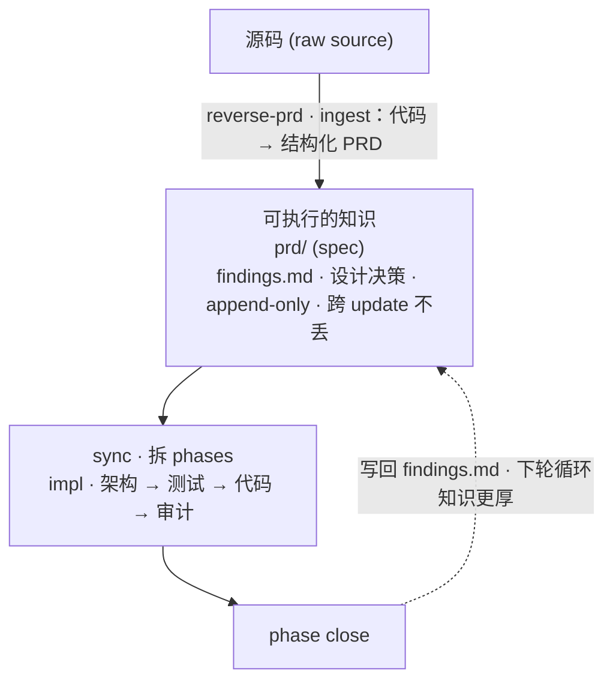

# super-manus

> 🌐 **语言**: [English](README.md) · **简体中文**

> **v0.9.8 发布说明 —— 工程 wiki 层**（v0.9.7 的纯加层；一个 helper 重命名；drift gate 加第 4 道非阻塞 pass）：
>
> 这一版的动机是**给跨模块的工程经验找一个真正的家**。v0.9.4 R6 已经通过 `sm_collect_reflections` 做了跨 update 的反思记忆，但 scope 锁在单模块——模块 A 学到的教训（比如 "Python 3.12 弃用了 `datetime.utcnow`"）传不到模块 B 下个 phase 的架构师手里。Dogfooding 时发现 orchestrator 手动从兄弟模块捞 findings 注入当作 workaround。v0.9.8 把这条通道做成一等公民：项目级 `wiki/` 层 + reviewer flag ingest + 4 spawn point 注入 + on-demand lint。
>
> - **新增** `docs/super-manus/wiki/` 目录（项目级，与 `prd/` 同级）。LLM 维护的 `_index.md` 目录 + append-only `_log.md` 事件账本 + 按需创建的 `<topic>.md` 主题文件（首次 promote 时创建，**不种**——每个项目自己积累）。`/super-manus:start` 种空骨架（幂等——已有项目重跑也能补上）。
> - **新增** reviewer `wiki-candidates:` verdict 字段（仅 pre-close）+ orchestrator promote gate（每个候选过一次 `AskUserQuestion`；accept 时 append 到 `wiki/<topic>.md` + 重生成 `_index.md` + 写 `_log.md` 一条 `promote`）。**reviewer-only funnel + 用户 gate** 是设计选择——自动 promote 被显式否定（wiki bloat 是长期失败模式）。
> - **新增** wiki 注入到 4 个 spawn 点（architect Pass 2 / test-writer / code-writer / reviewer × 3 个 checkpoint）。Writer 们 honor wiki rule；reviewer enforce（任何 writer 违反 wiki = `RETURN_TO_<writer>`，与 spec 违反同等级）。每个 phase 只 `sm_load_wiki` 一次绑定为 `$WIKI_BLOCK`，下面所有 spawn 复用同一份内容。
> - **新增** `/super-manus:wiki-lint` 命令 + drift gate **Pass 4**（`impl-reviewer` 走新模式 `mode=wiki-lint`）。五项扫描：contradiction / stale / orphan / gap / cross-ref miss。每次扫描在 `wiki/_log.md` 写一条 `## [date] lint | ...`。**非阻塞**——把 wiki 健康情况告知用户但不挡里程碑收尾。
> - **简化** 跨 phase 反思的传递机制。`sm_collect_reflections`（v0.9.4 R6）退役，换成简单的 `sm_load_update_reflections` —— **仅当前 update**，无跨 update glob、无 keyword 过滤、无 K=5 截断。Spawn prompt 里的 `<prior_reflections>` 块改名 `<update_reflections>`。**跨 update 记忆现在只走 wiki**；不够通用进不了 wiki 的模块本地经验在 update 边界自然淡化（同问题踩 2-3 次后自我矫正）。Per-phase token 预算副作用是稍稍降低。
>
> **这版没解决什么**（诚实标出天花板）：
> - **不种 starter wiki rule** —— 项目从空 `wiki/` 起步。第一次 promote 才创 topic 文件，不附带 opinionated 的 runtime / paths / testing 脚手架。（拒因：装作知道每个项目都需要哪些规则。）
> - **基于 `retries ≥ N` 启发式的自动 promote** —— 显式否定。reviewer-flag-only 是唯一 ingest 路径。代价不对称：bloat 是失败模式，false-negative 下次 phase 还能补救。
> - **reviewer 再次 flag 用户已 reject 的同条候选** —— orchestrator **不**预查 `wiki/_log.md` 历史的 `promote-rejected` 行就再问一遍用户。延后处理——先不加预查，等 dogfooding 真的暴露疲劳再加。
> - **`/super-manus:wiki-promote` 手动命令** —— 没有"不等 phase 失败直接 promote 这条规则"的命令。延后到 v0.9.9——经 phase findings + reviewer flag 的自然路径已覆盖常见场景。临时需求可以手编 `wiki/<topic>.md`。
>
> 完整设计见 `docs/design-v0.9.8.md`。

> **v0.9.7 发布说明 —— 多人协作基线**（v0.9.6 的纯加层，一次 schema 迁移自动处理）：
>
> 这一版的动机是**让 2-10 人小团队顺畅协作**：现状是个人 / 双人项目跑得很顺，但只要第二个开发开始往同一仓库提 PR，`drift_log.md` 和 `roadmap.md` 末尾就会反复撞行；跨模块改动也没有自动指派 reviewer 的机制。v0.9.7 用最小代价（git 原生 `merge=union` + 一份 CODEOWNERS 模板 + drift_log 增列）把这些摩擦点抹掉，让 3-10 人团队能舒服共用一个 super-manus 项目。
>
> - **新增** `.gitattributes`：`drift_log.md` 和 `roadmap.md` 加 `merge=union`。两个开发在不同分支同时往这两个 append-only 文件末尾加行，git 不再报 EOF 冲突。PRD/spec 故意不加（union 会让 Alice "200ms" 和 Bob "300ms" 静默共存，比冲突更糟）。
> - **新增** `templates/codeowners.example`——拷到 `.github/CODEOWNERS` 改占位符即可用。包含 super-manus 每个 module 必备的三条路径规则（PRD / spec / impl）+ 跨模块文件多 team review 规则 + GitHub CODEOWNERS 四大坑的内联文档（gitignore 风格匹配、同 org 限制、last-match-wins）。
> - `drift_log.md` schema：**4 → 5 列**（`| Date | Author | Module | Conflict | Resolution |`）。Author 来自 `git config user.name`（没配回退 `unknown`）。pre-v0.9.7 老项目下次跑 `sm-start.sh` 自动迁移：旧行注入 `unknown`，第二次跑是 no-op。
>
> **这版没解决什么**（诚实标出天花板）：
> - **两人改同一份 PRD / spec 的同一 H2 段、同一行** —— git 仍然会报冲突，由人手解。`merge=union` 故意不涵盖这种结构化文档（不然 Alice "200ms" + Bob "300ms" 会被静默并存，比冲突更糟）。
> - **同一 module 上并发跑多个 update。** 顺序迭代是完全支持的（Alice 做完 RBAC → PR 合并 → Bob 接着在上面做 OAuth —— 正常 PR 流程，不撞）。v0.9.7 没解决的是**同模块两个 update 同时跑**：会撞 PRD bullet 和源码，因为全局账本 union merge 不扩展到结构化文档。同模块高并发要等后续 in-flight marker（v0.10 候选）。**实用建议**：同一时间一个 module 一个分支只让一个人做。
> - **团队规模上限大约 10-15 人** —— 模块数 > 15、或跨 team 共用一个仓库时，单一 `_index.md` / `drift_log.md` 视野就不够了。这一步要 workspace 拆分（v1.0 候选）。
>
> 看起来像局限但其实不是的（澄清一下）：（a）"被打断后切回原 update" —— super-manus 本来就能干。`sm_active_update` 按 mtime 解析最近 update folder，切去 hotfix 回来直接跑 `/super-manus:impl` 就续上。（b）"看队友在做什么" —— `git pull` 就够，`drift_log.md` 新行 + `impl/<module>/<update>/` 新文件夹就是可见性信号。（c）任务分配 / 看板 / SLA —— 设计上就不在 super-manus 范围内：它是 PRD 驱动开发工具，不是项目管理工具。要这些请配合 Linear / Jira / GitHub Projects。
>
> 完整设计见 `docs/design-v0.9.7.md`。

> **v0.9.5 重大重命名**（无向后兼容别名）：
> - `/super-manus:reverse-prd` → **`/super-manus:reverse-prd-spec`**（现在同时产出 PRD 和 spec；用 2nd positional `both | prd | spec` 选 scope，或交互选）
> - `prd_drift.md` → **`drift_log.md`**（两个 H2 sections：`## PRD drift` + `## Spec drift`；v0.9.5 是 4 列 schema，v0.9.7 R15 加了 Author 列）。`sm-start.sh` 在下次 run 时自动迁移老项目。
> - Agent `reverse-prd-architect` → **`reverse-architect`**（如果你在 `.super-manus/agents.yml` 设了 override，要更新条目）。
> - **新增** `prd/<module>.spec.md`——每个 module 的工程参考文档（4 个 H2 sections，与 `<module>.md` 同级，required per module）。
> - **新增** `/super-manus:spec-update <module>`——`/super-manus:prd-update` 的 spec 端对应命令。
>
> 本 README 后面的"过往版本"章节保留旧名称（属于历史叙述，准确反映各版本当时的状态）。完整设计见 `docs/design-v0.9.5.md`。

**LLM Wiki + PRD 驱动开发的工程化闭环。**

super-manus 把两个模式合起来：[LLM Wiki](https://gist.github.com/karpathy/442a6bf555914893e9891c11519de94f) 负责知识积累，PRD 驱动开发负责执行纪律。Agent 把代码编译成意图的知识库（PRD），知识库驱动下一阶段，phase close 把决策归档回知识库。一个闭环，两半都在，不依赖聊天上下文。



这个闭环不是理念，是 4 根工程支柱钉死的：

1. **写一次 PRD，靠改 PRD bullet 持续迭代发版 —— 每一步都落盘。** 计划、决定、finding、drift 记录跨 `/clear`、`/compact`、重开会话存活。一个项目一个 PRD（target state），每个模块的里程碑文件夹是时间序列。orchestrator 不依赖聊天上下文判断当前进度。

2. **静态 + 动态分析从既有代码库重建 PRD 和 spec。** `/super-manus:reverse-prd-spec`（v0.9.5 R9 从 `/super-manus:reverse-prd` 重命名）跑 runtime-first 的模块发现（compose / Makefile / 源码结构），加一道被动 runtime 探针（运行中的进程 / 监听端口 / OpenAPI 契约 / git 删除+冷度信号）。一次源码探索同时产出 `prd/<module>.md`（PM voice）和 `prd/<module>.spec.md`（工程 voice——schema、契约、算法），用户交互选 scope（`both | prd | spec`）。长期未运行的代码会被标 `(audit — runtime-unverified)`，而不是被当作"活模块"装进 PRD；纯静态读不到的运行时动态路由通过 `curl /openapi.json` 交叉比对捕回。

3. **每次迭代都把 PRD/spec 和代码的漂移记下来 —— 不会悄悄抹平。** 代码有而 PRD 没承诺的 capability、PRD 承诺而代码没做的承诺，都会作为追加行写入 `drift_log.md ## PRD drift`（v0.9.5 R10 从 `prd_drift.md` 重命名；spec 和代码的不一致写入 `## Spec drift`）。"done" gate 在两个 H2 sections 总的 pending 行数为 0 之前不会翻牌（你决议：代码退回 / PRD 前进 / spec 前进）。Agent 不会自行修改 PRD 或 spec。

4. **架构师、测试 writer、代码 writer 是上下文隔离的独立 agent，由一个只读 reviewer 审上面三个。** 代码 writer 不能修改自己的测试 —— 工具权限、persona、orchestrator 侧 hash 校验三层各自独立。reviewer 在 3 个 checkpoint（`pre-test`、`pre-code`、`pre-close`）审 plan → tests → code，verdict 是 `APPROVE`、`RETURN_TO_<writer>` 或 `ESCALATE_TO_USER`，每个 checkpoint 有重试预算。phase 测试在 red 状态先 commit，代码 writer 之后才被 spawn。

## 安装

**推荐 —— marketplace：**

```
/plugin marketplace add https://github.com/lianghaofeng/super-manus-skill
/plugin install super-manus@super-manus-skill
```

后续更新通过 `/plugin marketplace update super-manus-skill`。

**本地 marketplace**（本地开发，或远程装失败时）：

```
/plugin marketplace add /path/to/super-manus
/plugin install super-manus@super-manus-skill
```

首次安装后重启 Claude Code session，让 hooks 和 slash 命令注册。

## 怎么用

日常循环很小：写一次 PRD，然后通过编辑 PRD bullet + 跑 phase 来迭代。每件事都是一条 slash 命令。

### 命令清单

| 命令 | 什么时候跑 | 做什么 |
|---|---|---|
| `/super-manus:start` | 项目开头一次 | 建 `docs/super-manus/prd/`、`impl/`、`roadmap.md`、`drift_log.md`（v0.9.5 R10 从 `prd_drift.md` 重命名）、`wiki/_index.md` + `wiki/_log.md`（v0.9.8 R16——topic 文件首次 promote 时按需创建；`e2e/` 由 `impl-test-writer` 第一次写 e2e 时懒创建）。在 pre-v0.9.5 / pre-v0.9.8 老项目上重跑会自动：迁移 legacy `prd_drift.md`、补齐缺失的 `<module>.spec.md` 同级文件、补齐缺失的 `wiki/` 骨架——幂等。 |
| `/super-manus:brainstorm` | 新项目 | 6 题 PM 访谈 → 写 `prd/_index.md` + 各模块 `prd/<module>.md` 雏形（v0.9.5 R7：以及对应的空白 `prd/<module>.spec.md` 工程参考雏形）。 |
| `/super-manus:reverse-prd-spec` | 现有项目还没 PRD/spec | 读代码（runtime-first 模块发现），写 `prd/_index.md`（含 Mermaid 架构图）+ 各模块 PRD stub 和/或 `<module>.spec.md` 工程参考。Scope 交互选（`both | prd | spec`）。v0.9.5 R9 从 `/super-manus:reverse-prd` 重命名；agent 重命名为 `reverse-architect`。 |
| `/super-manus:prd-update <module>` | 加新能力 / 解决 PRD drift | 对单份 `prd/<module>.md` 做 5 选 1 结构化编辑：**add / tighten / split / demote / exclude**。模式（前向迭代 vs drift 吸收）从 `drift_log.md ## PRD drift` 自动判定。 |
| `/super-manus:spec-update <module>` (v0.9.5 R8) | 加工程契约 / 解决 spec drift | 对单份 `prd/<module>.spec.md` 做单 section 编辑（工程 voice——schema、代码标识符、文件路径都允许）。模式从 `drift_log.md ## Spec drift` 自动判定。Drift 吸收不写 findings.md（工程实现，不是产品决策）。 |
| `/super-manus:sync <module>` | PRD 改完之后 | 读 `git diff prd/<module>.md`，草拟 3-6 个候选 phase，scaffold 里程碑文件夹。 |
| `/super-manus:impl` | 跑一个 phase | 端到端跑一个 phase（architect → review → test-writer → review → code-writer → review → verify → close），然后停。Reviewer 在 3 个 checkpoint（pre-test / pre-code / pre-close）驱动 re-spawn 循环，每个 checkpoint 有独立 retry 预算。 |
| `/super-manus:impl-all` | 跑完整个里程碑 | 把当前 update 所有 pending phase 串起来跑，中间不停。每个 phase 仍走完整 4-agent 流水线 + 3 review checkpoint + drift check。 |
| `/super-manus:drive` | "下一步干啥？" | 读全状态，从 brainstorm / sync / prd-update / impl 中选一个，公布决定 + 理由，执行。 |
| `/super-manus:catchup` | 新 session | 把 PRD 总览 + 当前 update 的 task_plan 重新注入上下文。 |
| `/super-manus:log` | 手动 checkpoint | 立刻往当前 update 的 `progress.md` 追加一条 session log。 |
| `/super-manus:wiki-lint` (v0.9.8 R19) | on-demand wiki 体检 | 把 `impl-reviewer` spawn 成 `mode=wiki-lint`，扫 `docs/super-manus/wiki/`，找 contradiction / stale / orphan / gap / 断链。在 `wiki/_log.md` 写一条 `## [date] lint | standalone`。**非阻塞**——只报告，不挡任何流程。同一份扫描也作为 end-of-update drift gate 的 Pass 4 自动跑；这条命令是给 off-milestone 用（月度维护 / 大改 PRD 后体检 / 发布前 audit）。 |

### `/super-manus:prd-update` 的 5 种编辑

PRD 编辑是结构化的，不能自由发挥。一次改一条 bullet。命令的提示按 a–e 字母顺序给出：

| 字母 | 选项 | 用在 | 效果 |
|---|---|---|---|
| **a** | Tighten | 表述太虚 | 用更锐利的用户可见语言 + 技术证据重写一条 bullet。 |
| **b** | Split | 一条 bullet 实际上是两个能力 | 把一条拆成两条，各自可独立审计。 |
| **c** | Demote | 之前承诺过头了 | 移到 `## Open questions`。 |
| **d** | Exclude | 不再在范围内 | 移到 `## Out of scope`。 |
| **e** | Add | 新加一个能力 | 往 `## What users get` 末尾追加一条 bullet。 |

任何编辑之后跑 `/super-manus:sync <module>` scaffold 下一个里程碑。

### 例 1 —— 全新项目，从头到尾

```bash
# 1. 启动
/super-manus:start
/super-manus:brainstorm
# 6 道 PM 风格的题，最后一题是模块拆分。
# 写 prd/_index.md + 各模块雏形，roadmap 标 not-started。

# 2. 你审 prd/api.md，把 ## What users get 写成实际想要的能力。
# PM 语气，最多 ~2000 词。

# 3. 为 api 模块切第一次里程碑
/super-manus:sync api
# 读 `git diff prd/api.md`，sync-planner agent 草拟 3-6 个 phase。
# 建 docs/super-manus/impl/api/2026-05-07-bootstrap/
# 含 task_plan.md（phase 表）+ findings.md + progress.md。
# 你审 phase，需要可改。

# 4. 把这次里程碑出清
/super-manus:impl-all
# 每个 pending phase：
#   - impl-architect 草拟 tasks/p<n>_impl.md
#   - impl-reviewer (pre-test)  → APPROVE / RETURN 给 architect
#   - impl-test-writer 提交红 phase + e2e 测试
#   - impl-reviewer (pre-code)  → APPROVE / RETURN 给 test-writer 或 architect
#   - impl-code-writer 写源码到测试翻绿
#   - impl-reviewer (pre-close) → APPROVE / RETURN 给任意上游 writer
#   - orchestrator hash check + 跑 ## Verification 命令
# 每个 checkpoint 最多容忍 2 次 RETURN；第 3 次 RETURN 升级到用户。
# 收尾时：drift gate 拒绝在 e2e 没覆盖每个触及的
# ## What users get 能力时把 roadmap 翻成 stable。
```

### 例 2 —— 中途加一个能力

你想到 API 还需要限流。先别去写代码 —— 先写 PRD。

```bash
# 1. 通过 PRD 把新能力浮出水面
/super-manus:prd-update api
# 选 "add"，回答 2-3 个关于新 bullet 的问题。
# 直接编辑 prd/api.md 的 ## What users get。
# 自动判定为前向迭代模式（没有 drift 行）。

# 2. 为新能力切一次里程碑
/super-manus:sync api
# 读 prd/api.md 的 diff，为"限流"草拟 phase。
# scaffold docs/super-manus/impl/api/2026-05-07-rate-limiting/。

# 3. 出清
/super-manus:impl-all
```

### 例 3 —— 代码偏离了 PRD

实现的过程中你顺手加了一个 PRD 里没承诺的 metrics 端点。drift checker 拦住你，往 `drift_log.md ## PRD drift` 追加一条 `pending` 行（v0.9.5 R10 从 `prd_drift.md` 重命名）。两条路：

```bash
# 路 A —— 回退代码，跟 PRD 对齐。
git revert <commit>

# 路 B —— 让 PRD 跟过来（drift 吸收）。
/super-manus:prd-update api
# 自动判定为 drift 模式（api 模块在 ## PRD drift 有 pending 行）。
# 选 "add" 把 metrics 端点合法化。
# 同步往当前 findings.md 写一条 Decision；
# drift_log.md 那条行的 Resolution 翻出 `pending`。
# 收尾 gate 解锁。
```

### 例 4 —— 接手一个现存项目

```bash
# 项目有代码，但还没 PRD/spec。
/super-manus:start
/super-manus:reverse-prd-spec
# 选 scope: both | prd | spec（首次 run 推荐 both）。
# Stage 1 —— runtime-first 模块发现（compose / Makefile / apps / scripts）。
# Stage 2 —— 被动 runtime 探针（v0.8.0）—— ps、监听端口、docker ps、
# curl /openapi.json、git 活跃度。如果 compose 服务停着，会通过
# AskUserQuestion 问要不要启动。
# Stage 3 —— spawn reverse-architect（首席架构师 + 资深 PM 双
# persona）；架构师把静态阅读跟 runtime_facts 交叉校验后，写
# prd/_index.md（含必需的 Mermaid 架构图）+ 各模块 PRD stub
# 和/或 <module>.spec.md 工程参考。

# 2. 审 (audit) 标记 —— 架构师拿不准的地方。v0.8.0 三类新子标记标
# 出具体的分歧类型：
#   - (audit — runtime-unverified)        静态有，运行时没确认
#   - (audit — runtime-only)              OpenAPI 列了路由但静态找不到源
#   - (audit — source-runtime-conflict)   静态和运行时直接矛盾
# 然后按模块：
/super-manus:sync <module>
/super-manus:impl-all
```

### 拿不准时

```bash
/super-manus:drive
# 读 PRD + roadmap + 当前 update + drift log，从
# brainstorm / sync / prd-update / impl 中选一个，
# 公布选什么 + 为什么，执行。
```

## 文件布局

super-manus 在使用它的项目里建出的磁盘布局：

```
<project-root>/
└── docs/super-manus/
    ├── prd/                                    # 项目级，单一真相源
    │   ├── _index.md                           # 项目总览 + 模块清单 + 数据流（目标 ~700 词散文；软上限，代码块与表格不计入）
    │   └── <module>.md                         # 每模块目标态（目标 ~2000 词散文；软上限，代码块与表格不计入）
    ├── e2e/                                    # 常驻回归套，按 prd/ 镜像（懒创建 —— impl-test-writer 第一次写 e2e 时建）
    │   ├── _system/
    │   │   └── test_<scenario>.<ext>           # 来自 prd/_index.md ## Demo 的跨模块场景；自动发现，CI 跑
    │   └── <module>/
    │       └── test_<capability>.<ext>         # 来自 prd/<module>.md ## What users get 的能力测试；自动发现
    ├── roadmap.md                              # 项目级，模块状态表（自动管理）
    ├── drift_log.md                            # v0.9.5 R10：项目级，append-only 漂移日志。两个 H2 sections（## PRD drift + ## Spec drift），相同 5 列 schema（v0.9.7 R15 加了 Author 列：| Date | Author | Module | Conflict | Resolution |）。Author 来自 `git config user.name`，没配回退 `unknown`。从 prd_drift.md 重命名。
    └── impl/                                   # 每模块的里程碑时间序列
        └── <module>/
            └── <YYYY-MM-DD>-<update-name>/     # 时间戳唯一出现的地方
                ├── task_plan.md                # 这次迭代的 phase 索引（Goal + Phases 表）
                ├── findings.md                 # 这次迭代的决定 / 错误 / 数据点
                ├── progress.md                 # 这次迭代的 commit + session log（hook 管理）
                ├── tasks/
                │   └── p<n>_impl.md            # 每个 phase 的技术方案（懒加载）
                └── tests/
                    └── phase_p<n>_<verb>_<noun>.<ext>  # phase 测试，里程碑级，CI 不自动发现
```

**两轴**（不重叠）：

- `prd/<module>.md` 是模块**是什么** —— target state。`## What users get` 装 schema 草图 / endpoint 轮廓 / 屏幕流；`## Quality bar` 装用户可见的 NFR。
- `impl/<module>/<update>/task_plan.md` 是这个模块**一次迭代怎么做**的总览。
- `impl/<module>/<update>/tasks/p<n>_impl.md` 是**怎么做**的细节 —— DB 迁移、API 代码、每个 phase 的文件 diff。

**两层测试**（不可互换）：

- `e2e/` —— **常驻回归**。PRD 能力活多久，e2e 就活多久。pytest 默认 `test_*.py` glob 自动发现；jest/vitest 项目需要在 config 加 `testMatch: ['**/test_*.ts']`，因为它们默认的 `*.test.ts` glob **不会**匹配 `test_<capability>.ts` 这种命名。CI 每次 commit 跑。是里程碑收尾的关卡。
- `impl/<m>/<u>/tests/` —— **里程碑级 phase 测试**。跟着 update 一起提交，里程碑收尾后可归档。**CI 不自动发现** —— 通过显式路径调用。`phase_*` 前缀就是为了避开默认 test runner 的 glob。

**没有 active 状态文件**。Hooks 用 `docs/super-manus/impl/<module>/*/` 的 mtime 扫描自动 resolve 当前 active update。一个项目 = 一份 PRD，老版本里的"feature"抽象已经移除。

**PRD 里不留 changelog 标记**。PRD 是当前态快照，历史在 `git log` 和每个 update 的 `findings.md` 里。

## 改已有 PRD

PRD 存在以后，三条路径可以改它，作用粒度不同，互不重复：

| 改动范围 | 路径 | Source of truth |
|---|---|---|
| 一行 PRD bullet（refine / split / demote / exclude / add） | `/super-manus:prd-update <module>` | 你的产品意图 |
| 一行 spec bullet（工程契约 / schema / design rationale） | `/super-manus:spec-update <module>`（v0.9.5 R8） | 你的工程意图 |
| 一整页模块 PRD 或 spec（代码漂移大，想刷新所有 section） | `/super-manus:reverse-prd-spec <module> [prd\|spec]` | 当前源码 |
| 全工程 PRD/spec（bootstrap，或者大改一轮） | `/super-manus:reverse-prd-spec [both\|prd\|spec]` | 当前源码 |

**简单规则**：`prd-update` / `spec-update` 干外科手术式编辑（PM voice / 工程 voice 各一）；`reverse-prd-spec` 干源码驱动的批量重写。`prd-update` 和 `spec-update` 都拒绝跨 section 改写；`reverse-prd-spec` 没有"改一行"入口。粒度不同。

**灰色地带——一个 section 里加 N 条 bullet**（比如想给多个模块批量补 Exposes/Consumes）：两边都不太顺手。`prd-update Add` × N 等于把 5 选项流程跑 N 遍；per-module `reverse-prd-spec` 会重写所选 scope 的全部 section。**手编通常最快**——[`templates/prd_module.md`](templates/prd_module.md) 和 [`templates/prd_spec.md`](templates/prd_spec.md) 里有精确格式。

### `prd-update` 怎么跑（两种模式，同一套选项）

同一套 5 选项，两种触发场景。命令读 `drift_log.md ## PRD drift` 自动判模式（v0.9.5 R10 从 `prd_drift.md` 重命名；spec 的 drift 在 `## Spec drift` 由 `spec-update` 处理）：

| `drift_log.md ## PRD drift` 里 `<module>` 有 pending 行吗？ | 模式 | 用在 |
|---|---|---|
| 没有 | **Forward iteration（前向迭代）** | 写代码 **之前** 加新能力 / 微调措辞 |
| 有 | **Drift absorption（drift 吸收）** | PRD 追上已经偏离的代码 |

调用端看不出区别 —— 同一条命令、同一套 5 选项。差别在副作用：

| 动作 | Forward | Drift |
|---|---|---|
| 编辑 `prd/<module>.md`（单 bullet、单 section） | ✅ | ✅ |
| 往当前 update 的 `findings.md ## Decisions` 写一条 3 行 Decision | — | ✅ |
| 翻 `drift_log.md ## PRD drift` 那行的 Resolution：`pending` → `prd-update: <a-e>` | — | ✅ |
| 动 `progress.md` | — （hook 管理） | — （hook 管理） |
| 收尾消息 | "跑 `/super-manus:sync <module>` scaffold 里程碑" | "Drift 行已 resolve，回去 resume update" |

**Tighten / Demote / Split** 三种动作在写之前会跑 [drift check protocol](skills/using-sm/SKILL.md)（LSP + grep 双源）核对受影响的 bullet —— 比如要"收紧"措辞，命令会先确认代码实际行为确实匹配新措辞，不只是用户记忆。**Add** 和 **Exclude** 跳过验证（Add 是新意图，Exclude 是去 scope）。

4 种情况它会拒绝并 redirect 你：

| 情况 | 建议 |
|---|---|
| 编辑跨过 `prd/<module>.md` 多个 section | 跑 `/super-manus:brainstorm`（替换式重写） |
| 偏离其实是 **技术决定**（比如"我们改用了 Redis 不是 Postgres"） | 不动 PRD —— 只在当前 update 的 `findings.md ## Decisions` 写一条 |
| PRD 跟代码已经对齐，没冲突 | 停，不要编一条编辑出来 |
| 编辑会把 `prd/<module>.md` 推过 2000 词 | `/super-manus:brainstorm` —— 这个模块已经撑不住一份 PRD 了 |

**技术决定**这条拒绝实际中最常见。PRD 是产品语义 —— "表 X 有字段 a/b/c" 这种 schema 草图可以；库名、文件路径、行号、代码标识符不行。如果一条"drift"实质上是"我们选了别的 DB"，那是 `tasks/p<n>_impl.md ## Approach` 的决定，不是 PRD 该动的地方。

`prd-update` 是「PRD 该动的时候你伸手用的工具」。下一节讲的是「**什么时候** PRD 可能该动」的那套系统 —— 也是阻止 agent 自己悄悄动 PRD 的机制。

## Drift 检测

super-manus 的核心铁律：**agent 永远不会静默更新 PRD 或 spec**。PRD/spec 和代码对不上时，分歧被写到 `drift_log.md`（v0.9.5 R10 从 `prd_drift.md` 重命名；PRD 侧在 `## PRD drift`，spec 侧在 `## Spec drift`）并暴露给你 —— 由你决定让代码回退、让 PRD 跟过来、还是让 spec 跟过来。

### 什么算 drift

| 方向 | 例子 | 术语 |
|---|---|---|
| 代码多了 PRD 没承诺的能力 | 加了 `GET /metrics`，PRD 没承诺可观测性 | **over-shoot（超出）** |
| 代码少了 PRD 承诺的能力 | PRD 写「支持 SSO」，代码完全没做 | **under-shoot（欠缺）** |
| 代码违反 `## Quality bar` 条款 | PRD 写 p99 < 200ms，实测 5s | **质量违约** |
| 代码越过 `## Out of scope` 红线 | PRD 排除移动端，但加了 React Native 入口 | **越界** |

流水线违规也会写到 `drift_log.md ## PRD drift`，行为完全一致：`code-writer modified tests for phase p<n>`（防作弊哈希不一致）、`test-writer touched non-test files`、`missing e2e coverage for capability <c>`、`e2e for capability <c> is red`。再加 v0.9.5 R7 的 missing-spec 行写在 `## Spec drift`：`missing <module>.spec.md`（R7 required-mode 强制）。它们都算进 gate 的 `pending` 总数，并且和 PRD-代码偏离一样，会拦住 roadmap 翻 `stable`。

### 什么时候跑

**不是后台守护进程**，是命令执行路径上主动跑的，6 个入口（来源是 [skills/using-sm/SKILL.md §4 Per-command application](skills/using-sm/SKILL.md)）：

| 触发时机 | 对比的内容 |
|---|---|
| `/super-manus:reverse-prd-spec`（v0.9.5 R9 从 `/super-manus:reverse-prd` 重命名） | 推断出的 PRD/spec 声明 vs 现有代码（初次 bootstrap） |
| `/super-manus:sync <module>` | 新里程碑的意图 vs 该模块当前 PRD |
| `/super-manus:prd-update`（Tighten / Demote / Split） | 收紧/降级/拆分后的 bullet vs 现有代码（写之前的验证） |
| `/super-manus:impl`（进入 phase 时） | phase 的 `## Objective` vs PRD `## What users get` / `## Quality bar` / `## Out of scope` |
| `/super-manus:drive` | PRD + roadmap + 最近 commit 消息提示（轻量 pre-action sweep） |
| End-of-update gate（4 pass —— v0.9.8 R19） | Pass 1 commits 刷漂移 + missing-spec / Pass 2 e2e 覆盖 / Pass 3 `pending` 必须为 0（阻塞）/ Pass 4 wiki-lint（**非阻塞**——把 wiki 健康度告知用户，永不挡里程碑收尾） |

### 检测机制

协议在 [skills/using-sm/SKILL.md §4](skills/using-sm/SKILL.md)，用两种工具回答不同问题：

- **LSP**（`workspace_symbols`、`document_symbols`、`find_references`）—— 结构性事实：PRD 声称的 symbol 在索引过的代码里到底存不存在？
- **grep + Read** —— 文本信号：TODO 注释、route 路径、配置文件、license 条款，凡是 LSP 索引不到的。

**双源规则（double-source rule）**：一条 drift 结论必须 LSP 和 grep **在两者都适用时**都同意（有些推断目标 —— Quality bar、Risks、产品 intent —— 本质上 grep- 或 Read-only，LSP 用不上）。单源结论会变成 `(audit)` 标记 —— 可以 inline 写在 `prd/<module>.md` 或 `prd/<module>.spec.md` 任何位置，或者归到 `## Open questions` —— **不进 drift_log.md**（v0.9.5 R10 从 `prd_drift.md` 重命名）。每次检查的预算：≤10 次 LSP 调用 + ≤30 次 grep/Read 调用；超预算 → 停下报告，不做穷举式扫描。

LSP 不可用时（冷项目、多语言仓库、缺工具链）→ grep-only 模式，所有结论都带 `(audit)` 标。

### 检测到 drift 之后

```
检测到
   ↓
往 drift_log.md ## PRD drift 或 ## Spec drift append 一行（Resolution = pending）
   ↓
agent 停下，给你 resolve 路径：
   1. /super-manus:prd-update <m>      —— 让 PRD 跟过来（## PRD drift 行翻 Resolution → prd-update: <a-e>）
   2. /super-manus:spec-update <m>     —— 让 spec 跟过来（## Spec drift 行翻 Resolution → spec-update: <section>）（v0.9.5 R8）
   3. /super-manus:reverse-prd-spec <m> spec —— 对 "missing <module>.spec.md" 行，从源码 seed
   4. git revert <commit> + 编辑该行    —— 让代码退回 PRD/spec；手动改 Resolution = reverted，并在 findings.md 写一句 why
   5. 补缺失的 e2e + 重跑 gate          —— 对 Pass 2 "missing/red e2e" 行，补 e2e 让它绿，gate 自己清
   ↓
你决定。agent 绝不静默改 PRD 或 spec。
   ↓
收尾 gate 在该模块两个 H2 sections 还有任何 pending 行时
拒绝把 roadmap 翻成 stable
```

`drift_log.md`（v0.9.5 R10 从 `prd_drift.md` 重命名）是 **行级别 append-only** —— 只有 Resolution 单元格可变；行本身永不删除、永不重排。两个 H2 sections（`## PRD drift` 和 `## Spec drift`）都遵守这条规则。这套机制和"防止写实现的 agent 给自己测试放水"是同一个底层原则 —— 没有静默覆盖，每一处分歧都留底。

## 自给自足的执行纪律

super-manus 不依赖任何别的 workflow 插件。执行层是内置的：

- **`impl-reviewer` agent + 3 个 review checkpoint（v0.7）** —— 只读 agent，在 impl 流水线的三个点上：
  - **`pre-test`**（architect 之后、test-writer 之前）—— 核对 plan 的声明对照真实数据（对每个声称的输入跑 `head -1`、`(audit)` 标记必须 resolve、每个声明的输入在 `## Verification` 里都要有 smoke）。
  - **`pre-code`**（test-writer 之后、code-writer 之前）—— 核对 fixture 用真实数据样本（不是从 architect 的 plan 文本派生的 inline dict）、覆盖所有声明输入、测试如预期是红的、测试通过项目配置的 type-check（无配置则跳过）。
  - **`pre-close`**（code-writer 之后、verification 之前）—— 核对实现匹配 `## Approach`、改的文件是 `## Files touched` 的子集、无安全 smell。如果 code-writer 报 stuck（"tests un-passable"），reviewer 诊断到底是测试、plan 还是代码出问题。
  
  Verdict：**APPROVE** / **RETURN_TO_<writer>** / **ESCALATE_TO_USER**。RETURN 可以指向任意上游 writer——`pre-close` 看到失败的 fixture 错可以 RETURN_TO_TEST_WRITER，看到 plan 写错可以 RETURN_TO_ARCHITECT。Orchestrator 串联——重 spawn 目标 writer + 所有下游阶段，新 test 提交后刷新 hash baseline，再回到原 review。**每个 checkpoint 的预算：最多 2 次 RETURN；第 3 次 RETURN 升级到用户**，附完整反馈历史。Reviewer 的 **工具栏只读**（无 `Write`，无 `Edit`）—— 防作弊边界完整保留。

- **`tdd-in-phases`** —— `/super-manus:impl` 进入一个 phase 时，test-writer 在 code-writer 之前 spawn（不可商量）。Phase 测试 + e2e 测试以红色提交；code-writer 把它们翻绿，并且禁止改测试。三条独立机制堵住"写实现的 agent 给自己测试放水"：
  - **时间** —— 测试在 code-writer spawn 之前已经在 git 里了。
  - **写权限** —— code-writer 的 persona 禁止改测试；orchestrator 哈希测试文件（在 `pre-code` review APPROVE 之后）、code-writer 跑完后再哈希一次比对，被改就中止。
  - **Persona** —— test-writer 把测试锚定在 PRD 的 `## What users get` / `## Quality bar` / `## Risks` 加上 `_index.md ## Demo`（跨模块场景 → `e2e/_system/`），把 `## Approach` 当成"众多合法实现之一"。
- **`verification-before-phase-close`** —— phase Status 翻 `closed` 之前，`tasks/p<n>_impl.md ## Verification` 里的每条命令必须返回 0。`## Verification` 至少包含 (1) 本 phase 的 phase 测试路径命令，(2) 一条用户可见的 smoke 命令。
- **`systematic-debugging-in-phase`** —— verify 失败时按 checklist 走（重读 Approach、重读失败测试、对 diff 二分查找、写一条回归测试，再 fix）。同一类错误三次 → 上报。

如果你之前把 super-manus 和 `obra/superpowers` 一起装，现在不再需要了。v0.5+ 把 superpowers 里真正合 PRD-led loop 的三块（TDD / verification / 系统化调试）吸收进来；剩下的要么和 super-manus 重叠，要么正交。

## 不做的事

主动留在范围外：

- 模块改名命令（手动：改文件夹名 + 编辑 `prd/_index.md`）
- 单 super-manus 文件夹下的多产品 monorepo 支持（用多个 super-manus-enabled 子目录）
- 自动把 phase 测试升级成 e2e（手动：移文件 + 改名）
- 给 v0.4 老项目回填 e2e（自己补，或者等以后有 phase 触及那个能力时由 test-writer 顺手补）
- 多 harness 编排 / PR 创建 / 合并集成
- 测试框架 / runner —— super-manus 调用你项目已有的（`pytest`、`npm test`、`cargo test`、`go test`、`Makefile` 目标），不强加一个

## 更新历史

`.claude-plugin/plugin.json` 是版本号的唯一真相源。每个版本下面链了对应的 design 文档。

### v0.8.4 —— 当前

README 围绕 **LLM Wiki + PRD 驱动开发** 框架重新定位。结构映射（代码 → `reverse-prd` → `prd/` + `findings.md` → `sync`/`impl` → close → 归档）在 v0.8.3 就已经完整——v0.8.4 把这个闭环显式化，加了 `## 它是什么` 一节配 Mermaid 循环图，hero 改成两个模式的融合定位。

**v0.9.8 R16 翻案**：v0.8.4 评估并放弃过 `docs/super-manus/wiki/`，理由是现有文件（`prd/<module>.md`、`roadmap.md`、`progress.md`、`findings.md`）覆盖了 LLM Wiki 原语。v0.9.8 翻这个案——dogfooding 暴露真实缺口：**跨模块的工程经验没有家**。模块作用域的 `findings.md` 带不动 "Python 3.12 datetime API" 这类规则从一个模块的反思传到另一个模块下个 phase 的架构师。PRD/spec 回答"这个模块做什么"，wiki 回答"我们在这项目里怎么写代码"。两层互补（PRD/spec 单模块，wiki 项目全局），不是重复。详见 [docs/design-v0.9.8.md](docs/design-v0.9.8.md) 含影响新设计的 LLM Wiki 长文阅读笔记。

零代码 / schema / agent / hook / 模板 / 测试改动。纯文档 + 定位。

### v0.8.3

`prd/_index.md ## Data flow overview` 和 `prd/<module>.md ## How it connects` 的子图从 ASCII box-drawing 字符切到 **Mermaid** `flowchart` 块。ASCII 是 v0.7 时代的选择，在 2026 年的 GitHub / GitLab / VS Code / Obsidian 里 Mermaid 都能 inline 渲染——架构图在 PR review 时直接以图的形式可视，而不再是定宽文本。三种 node 形状区分角色：`<id>[<name>]` 模块（矩形）、`<id>[(<image>)]` 存储/队列类 infra（圆柱）、`<id>([<actor>])` 外部 actor（体育场形）；边的 label 携带协议（`parent_api -->|HTTP /api/orders| order_api`）。MODULE-DIAGRAM 1:1 不变量没变——所有 module 类型节点的 label 仍必须跟 `## Modules` 表的行一一对应。

`(for: <capability>)` 这种语义标注从图里搬到边列表 backup 里——保持 Mermaid 块视觉清爽。已有 ASCII 图继续可读；重跑 `/super-manus:reverse-prd` 会用 Mermaid 重新生成。详见 [docs/design-v0.8.md](docs/design-v0.8.md) §10。

### v0.8.2

两层修正一起发。**Layer B**：3 个 writer agent（`impl-test-writer` / `impl-code-writer` / `sync-planner`）的 frontmatter 从 `model: opus` 改成 `model: inherit`。v0.8.0 把所有 6 个 agent 都钉死成 `opus`，副作用是悄无声息地堵了 Claude Code 原生的 `CLAUDE_CODE_SUBAGENT_MODEL` 环境变量通道（这个 env var **只对 frontmatter 是 `inherit` 的 subagent 生效**，显式 `model: opus` 完全无视它），同时让 Sonnet 4.6 主线程的用户被默默全程跑 opus、白多花钱。改成 `inherit` 之后，writer 跟随主会话模型——Opus 主线程 → opus writer（Opus 用户体感无变化），Sonnet 主线程 → sonnet writer（自动省钱）。3 个 thinker agent（`impl-architect` / `impl-reviewer` / `reverse-prd-architect`）保持 `model: opus` 作为质量底线——这三个一旦悄悄降级到 sonnet，v0.7 review pipeline 的价值就被抹平了。

**Layer A**：文档纠错。v0.8.0 的文档说 `effort:` 不可 override，**那是错的**。`CLAUDE_CODE_EFFORT_LEVEL` 环境变量是优先级最高的 effort 来源（盖过 frontmatter，盖过其他配置），这是 Claude Code 官方文档的解析顺序。v0.8.2 把 `docs/design-v0.8.md §4 / §8 / §9`、`templates/agents.yml`、4 个 spawning command markdown 里关于 model / effort 优先级的描述全部改对了，附完整优先级表。详见 [docs/design-v0.8.md](docs/design-v0.8.md) §9。相对 v0.8.1 纯加性——零 API 变化、零迁移；唯一测试契约变更是 writer 测试断言从 `^model: opus$` 翻成 `^model: inherit$`。

### v0.8.1

通过 `.super-manus/agents.yml` 实现项目级 model override。`hooks/lib.sh` 新增 `sm_agent_model <agent>` helper，读一个扁平的 `<agent>: <model>` 配置文件（值 `opus | sonnet | haiku`）；4 个会 spawn agent 的命令（`/super-manus:impl`、`/super-manus:impl-all`、`/super-manus:reverse-prd`、`/super-manus:sync`）在调用 Agent 工具之前先查这个文件，非空就把 `model:` 传进去。`/super-manus:start` 从 `templates/agents.yml` 拷一份默认空配置（所有 agent 都注释掉），用户按需开启。

`.super-manus/` 目录被**重新启用**，但**只放静态用户偏好**——v0.4 拆掉的是 `.super-manus/active`（动态状态）那条不变量，今天依然成立：active update resolution 仍然走 `sm_active_update` 的 mtime 扫描。这个拆分是有意为之——`docs/super-manus/` 是业务状态（PRD / roadmap / impl 历史），review PR diff 时会过；`.super-manus/` 是工具配置，配一次几乎不动。两个都 commit。

`effort:` 故意不通过 `agents.yml` 路由——Claude Code 原生的 `CLAUDE_CODE_EFFORT_LEVEL` 环境变量已经覆盖了这条 override，且优先级更高。详见 [docs/design-v0.8.md](docs/design-v0.8.md) §8。相对 v0.8.0 纯加性。

### v0.8.0

`/super-manus:reverse-prd` 加了被动 runtime 探针 + Cross-validation 协议，专治长寿项目的"死代码扰乱 PRD"问题。纯静态阅读会把废弃的 `apps/` 目录当成活模块、把没人监听的端口连成边、漏掉运行时动态注册的路由——v0.8.0 把这些短板补上。

新增 `scripts/probe-runtime.sh`——只读探针，捕获正在跑的进程（`ps`）、监听端口（`lsof` / `ss`）、docker 容器 + compose 服务、OpenAPI 契约（只对 compose 声明的端口 `curl /openapi.json`）、git 活跃度（最近 6 个月的删除 / 冷文件 / 热文件）。永远 exit 0；从不调用任何 mutating 命令；总耗时 ≤30s，每个外部调用都有超时（macOS 缺 GNU `timeout` 时回退 `perl alarm`）。

orchestrator 在 Stage 1（模块发现）之后、agent spawn 之前跑探针，把报告作为第 9 个 input `runtime_facts` 传给架构师。如果 compose 文件存在但服务没起来，orchestrator 通过 `AskUserQuestion` 询问是否 `docker compose up -d`（60s 超时）；探针脚本本身始终只读——只有 orchestrator 在用户明确同意的情况下才能发起 mutating 命令。

`reverse-prd-architect` 新增 `## Cross-validation with runtime_facts` 协议，5 条规则（模块活性 / 死代码嫌疑 / OpenAPI capability 三向比对 / 边的可信度 / 探针未跑兜底），3 个新 `(audit)` 子标记（`runtime-unverified` / `runtime-only` / `source-runtime-conflict`），加上更聪明的工具预算公式 `10 + 5×N + 10`（上限 60）替换 v0.7 的扁平 ≤10/≤30。同时 6 个 agent 的 frontmatter 加上**显式的 model + effort 路由**——全部 `model: opus`，thinker `effort: max`、writer `effort: high`（v0.8.2 把 writer 改成 `model: inherit`）。

详见 [docs/design-v0.8.md](docs/design-v0.8.md) §1–§4。v0.7 时代的 PRD bundle 继续工作——Cross-validation 第 5 条规则（探针未跑兜底）显式处理"没有 runtime_facts"的情况；新加的 `(audit — <subtype>)` 标记是裸 `(audit)` 之上的加性扩展，旧工具 grep `\(audit\)` 仍然命中。

### v0.7.5

`ESCALATE_TO_USER` 的 verdict 改成**双层语态**。2026-05 的真实 dogfood escalation（P4 picker 延迟）暴露了 v0.7.0 ESCALATE 输出是 engineer-to-engineer 风格——堆术语（"real-link bench RED"、commit hash 内联、plan/PRD 段号顶在前面）——用户读完得**自己再翻译一遍**才看得懂哪里卡住、能选什么。修法不是"把事实丢掉"（精确数字是 load-bearing 的——没有"比预期慢 27 倍"这条，用户没法分辨是软件配错还是硬件极限），而是**双层语态共存**。

`agents/impl-reviewer.md ## ESCALATE_TO_USER` 模板现在强制四段标签结构：

- `【发生了什么 / What happened】` —— 大白话开场，1-2 句，零术语，零 commit hash
- `【为什么不能自己解决 / Why the loop cannot converge】` —— 大白话归类（硬件物理极限 / PRD 自相矛盾 / scope 模糊 / budget 用光）
- `【关键事实 / Key facts】` —— 精确诊断：数字带对比（"5.3s / 30 docs（plan §5 假设 <200ms —— 27 倍慢）"）+ commit hash + PRD 锚点 + 测试状态 + 嫌疑/下一步诊断
- `【你可以选 / Options】` —— `[Recommended]` 严格只标一个（或不标），每个选项一行：名字 + 代价 + 期望结果

机器可解析头（`VERDICT:` / `mode:` / `phase:` / `attempt:` / `history:`）保持原样——orchestrator 解析逻辑零改动。`RETURN_TO_<writer>` 和 `APPROVE` 格式不动（那两类输出的读者是 agent，不是用户）。详见 `docs/design-v0.7.md` §14。相对 v0.7.4 纯 additive。

### v0.7.4

Reflexion 风格的跨 phase 经验持久化。`findings.md` 加了第 4 个 H2 段 `## Reflections`，append-only，由 `/super-manus:impl` orchestrator 在 phase close 时合成（仅当本 phase 有 ≥1 次 reviewer RETURN 才写）。每条是 `### Phase <n>: <name>` + 三个固定 bullet：`Misstep:`（表面事件）/`Root cause:`（根因）/**`Heuristic:`（给下个 phase 的可操作规则）**。**Heuristic 那一行是核心**——它是 Reflections 跟 `## Errors`（事件流水）和 `## Session log`（按时间叙述）的根本区别。

下一个 phase spawn `impl-architect` 时，spawning prompt 多一个 `prior_reflections` 输入（把整段 `## Reflections` 原文塞进去）；架构师把每条 `Heuristic:` 当 checklist 来对照 `## Approach` 和 `## Files touched`。**作用域只在 update 内**（跨 update 反思持久化暂缓——会跟"PRD 是唯一 spec"这条不变量冲突）；**由 orchestrator 主线程合成**（reviewer 保持 read-only by tool surface 不破）。相对 v0.7.3 纯 additive——PRD schema 不动、路径迁移不动、cheat-prevention hash 基线不动。详见 `docs/design-v0.7.md` §13。

v0.7.0 的 reviewer→writer `previous_attempt_feedback` 反馈通路是 plain Reflection——当场修当前的 bug。v0.7.4 加的是 Reflexion 那一层——把"writer 自己抓不出来的错"沉淀成下个 phase 默认就规避的规则。

### v0.7.3

修了 `impl-architect`：之前 agent 会对 `${CLAUDE_PLUGIN_ROOT}/templates/phase_plan.md` 直接 `Edit`（in-place 替换占位符），触发 Claude Code 对 plugin cache 下文件的 sensitive-file 权限提示，整个 phase 被卡住。原因是 seeding 流程（Bash + `sed` 输出到 `${update_dir}/`）被埋在 `## Idempotency` 末尾，容易被跳过。

重构 `agents/impl-architect.md ## Deliverable`，加了一段不可协商的 **Write barrier**（`Edit`/`Write` 只能落在 `${update_dir}/` 下；`${CLAUDE_PLUGIN_ROOT}/` 下的模板是 READ-ONLY），并把流程拆成有序三步，把 Bash+sed seeding 钉为唯一一条"从模板生成目标文件"的路径。`tests/test_agent_impl_architect.sh` 加了三条断言把这条 barrier 锁死。纯 agent-guidance 修复，不动 PRD schema、运行时 API，也不需要迁移。

### v0.7.2

`/super-manus:reverse-prd` 加了两个易用性改进：

- **Per-module 模式**：传一个已有的 `<module>` 名字进去，只刷新 `prd/<module>.md`，不动 `_index.md`、`roadmap.md`、也不动其它模块。适用于"某个模块代码改了想把它的 PRD 同步到最新（包括 v0.7.1 的 Exposes/Consumes 块）"，不需要重扫整个工程。刷完后 orchestrator 跑一次 **cascade scan**——grep 其它 `prd/*.md` 看哪些模块在 `## How it connects` 里提到了目标模块——然后打印一个 follow-up 列表，告诉用户哪些模块的"How it connects"可能已陈旧。**不会** silently regenerate 那些模块；用户自己决定要不要单独刷或手动改。新模块的 bootstrap 仍然需要整工程跑。
- **Soft-abort 二次确认**（取代 v0.7.0 的 hard-abort）：当用来判断是否覆盖的那一段（whole-project 看 `_index.md ## Problem`；per-module 看 `prd/<module>.md ## Why this exists`）已经写了真实人工内容时，orchestrator 不再直接拒绝，而是通过 `AskUserQuestion` 弹出确认（明确列出会覆盖什么）。之前那种"先备份、清回模板再跑"的麻烦没了——确认机制保留了"绝不静默覆盖"的安全属性，但摩擦小得多。

`agents/reverse-prd-architect.md` 加了两个新输入（`scope`、`target_module`）；`scope=single-module` 时只写 `prd/<target_module>.md`，并被明文禁止动 `_index.md` 或其它模块文件。详见 `docs/design-v0.7.md` §12。

### v0.7.1

PRD 模板小幅锐化，借鉴自一次 formal-PRD 框架讨论：

- **`prd/<module>.md ## How it connects`** 顶部加 `Exposes:` / `Consumes:` 语义前导块，原有 Upstream/Downstream/Third-party + edge list 紧随其后。条目是 PM 口吻的能力名词（"order placement"、"credit-score lookup"），不是 endpoint 路径。让模块的"对外契约面"在 PRD 里直接可见，模块拆分决策只看 PRD 就能审。
- **`prd/_index.md ## Data flow overview`** 的 edge list backup 强制 `(for: <capability>)` 标注：`<A> --<protocol>--> <B> [path/topic] (for: <capability>)`。`<capability>` 用的是和各模块 Exposes/Consumes 相同的词汇表。跨模块边从只带协议变成带语义。

两处都是**纯追加**——没有 heading 重命名，MODULE–DIAGRAM INVARIANT 保留，已有 PRD 不需要迁移（重跑 `/super-manus:reverse-prd` 自动填，或手动补）。`agents/reverse-prd-architect.md` 同步更新派生规则（Exposes 来自本模块 `## What users get`；Consumes 来自上游模块 `## What users get`；`(for: ...)` 来自被消费的 capability bullet）。完整 rationale 见 `docs/design-v0.7.md` §11。

### v0.7.0

加了 **`impl-reviewer` agent**，在 `/super-manus:impl` 和 `/super-manus:impl-all` 内部三个 checkpoint（`pre-test` / `pre-code` / `pre-close`）跑。工具栏只读（无 `Write`、无 `Edit`），驱动 re-spawn 循环，每个 checkpoint 最多容忍 2 次 RETURN，第 3 次 RETURN 带完整历史升级到用户。Verdict：`APPROVE` / `RETURN_TO_<writer>` / `ESCALATE_TO_USER`。RETURN 可指任意上游 writer——`pre-close` reviewer 可以 RETURN_TO_TEST_WRITER 如果失败测试的 fixture 错了，或者 RETURN_TO_ARCHITECT 如果 plan 在 impl 阶段才暴露写错。**防作弊保留**：hash baseline 在 `pre-code` review APPROVE 之后才建立，绝不更早。

为什么：2026 年 5 月一个 dogfood 案例（多源 parser）暴露了 v0.6 的 3-agent 线性信任链的两个结构缺陷——plan-time 编造（architect 列字段名但没 `head -1` 验证；5/6 源在生产里静默 drop）和 test-side 死路（测试写错时 code-writer 改不动测试，v0.6 的逃生通道概念上有但机制没接通）。Reviewer 通过注入外部真实信号（`head -1` 真数据、项目配置的 type-check、code-vs-plan diff 核对）打破这条信任链，并给循环一个干净的 RETURN-with-feedback 路径，不破坏 hash baseline。

详见 [docs/design-v0.7.md](docs/design-v0.7.md)。Plugin manifest 0.7.0；相对 v0.6 纯 additive（无路径迁移、无 PRD schema 改动、无测试 fixture 改动）。

### v0.6.1

修了 `impl-architect`：phase 测试现在强制声明在 `${update_dir}/tests/phase_p<n>_*.<ext>`，而不是借用项目原有测试套（`apps/<m>/tests/`、`docs/super-manus/e2e/`）。`tests/test_agent_impl_architect.sh` 加了配套断言。纯 agent guidance + template 修复，无路径迁移。

### v0.6.0 —— prd-update 双模式

`/super-manus:prd-update` 同时覆盖前向迭代（写代码前加新 bullet）和 drift 吸收（解决 `prd_drift.md` 的 pending 行）两种模式，模式从 `prd_drift.md` 状态自动判定。配套一次 docs sweep。v0.5 的所有内容沿用。详见 [docs/design-v0.6.md](docs/design-v0.6.md)。

### v0.5 —— 自给自足执行纪律 + e2e 回归

加了 **3-agent `/super-manus:impl` 流水线**（architect → test-writer → code-writer，test-writer 和 code-writer 之间有时间 / 写权限 / persona 三条边界）和 **常驻 e2e 回归套**（位于 `docs/super-manus/e2e/`，按 PRD 的 module/_index 结构镜像）。End-of-update drift gate 多了一个 **Pass 2 —— e2e 覆盖检查**：本次 update 触及的每个 `## What users get` 能力都需要有一个绿色的 `e2e/<module>/test_<capability>.<ext>`，否则 roadmap 不能翻 `stable`（Pass 3 仍然是 `pending == 0` 的总闸）。三个执行纪律 skill（`tdd-in-phases`、`verification-before-phase-close`、`systematic-debugging-in-phase`）随插件一起出。新增 `/super-manus:impl-all`。详见 [docs/design-v0.5.md](docs/design-v0.5.md)（已弃用）。

### v0.4 —— 项目级全局 PRD

两轴模型 —— 模块 × 里程碑 —— 替换 v0.2/v0.3 的 per-feature 文件夹。PRD 在 `docs/super-manus/prd/`（一个项目 = 一份 PRD）。实现按模块按里程碑放在 `docs/super-manus/impl/<module>/<YYYY-MM-DD>-<update-name>/`。Drift gate（PRD ↔ 实现对齐）变成 BLOCKING。`.super-manus/active` 指针文件移除 —— hooks 用 mtime 扫描 resolve。详见 [docs/design-v0.4.md](docs/design-v0.4.md)（已弃用）。

### v0.2 / v0.1 —— 早期版本

[docs/design-v0.2.md](docs/design-v0.2.md) 和 [docs/design-v0.1.md](docs/design-v0.1.md)。Per-feature 文件夹布局，`.super-manus/active` 指针文件。已弃用，保留作历史参考。
